# Jarkom-Modul-2-2026-K-56

| No  | Nama                           | NRP        | Pengerjaan |
| --- | ------------------------------ | ---------- | ---------- |
| 1   | Sahira Bilqis Rivadito         | 5027251037 | No         |
| 2   | Muhammmad Ridwan               | 5027251113 | No         |

## LAPORAN RESMI MODUL 2

### 1. Topologi Jaringan dan Pembagian IP Address
---

Sebagai pusat kesadaran **The Mesh**, `rootkit` berperan sebagai router utama yang menghubungkan seluruh Entitas di dalam jaringan. Router `rootkit` terhubung ke NAT sebagai jalur menuju jaringan luar dan juga terhubung ke lima switch yang membagi jaringan menjadi lima segmen.

Topologi yang digunakan dapat dilihat pada gambar berikut.

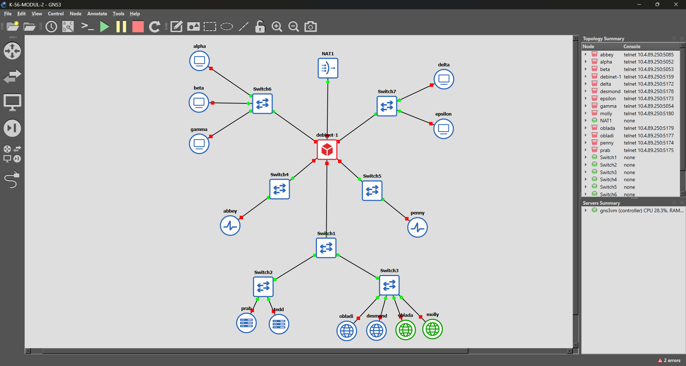

Pembagian subnet pada topologi adalah sebagai berikut.

| Segmen | Network | Gateway | Host |
|---|---|---|---|
| Switch 1 | `192.239.1.0/24` | `192.239.1.1` | prab, tedd, obladi, desmond, oblada, molly |
| Switch 2 | `192.239.2.0/24` | `192.239.2.1` | abbey |
| Switch 3 | `192.239.3.0/24` | `192.239.3.1` | penny |
| Switch 4 | `192.239.4.0/24` | `192.239.4.1` | alpha, beta, gamma |
| Switch 5 | `192.239.5.0/24` | `192.239.5.1` | delta, epsilon |

Pembagian IP setiap Entitas adalah sebagai berikut.

| Host | IP Address | Gateway |
|---|---|---|
| rootkit eth1 | `192.239.1.1/24` | - |
| rootkit eth2 | `192.239.2.1/24` | - |
| rootkit eth3 | `192.239.3.1/24` | - |
| rootkit eth4 | `192.239.4.1/24` | - |
| rootkit eth5 | `192.239.5.1/24` | - |
| prab | `192.239.1.2/24` | `192.239.1.1` |
| tedd | `192.239.1.3/24` | `192.239.1.1` |
| obladi | `192.239.1.4/24` | `192.239.1.1` |
| desmond | `192.239.1.5/24` | `192.239.1.1` |
| oblada | `192.239.1.6/24` | `192.239.1.1` |
| molly | `192.239.1.7/24` | `192.239.1.1` |
| abbey | `192.239.2.2/24` | `192.239.2.1` |
| penny | `192.239.3.2/24` | `192.239.3.1` |
| alpha | `192.239.4.2/24` | `192.239.4.1` |
| beta | `192.239.4.3/24` | `192.239.4.1` |
| gamma | `192.239.4.4/24` | `192.239.4.1` |
| delta | `192.239.5.2/24` | `192.239.5.1` |
| epsilon | `192.239.5.3/24` | `192.239.5.1` |

Konfigurasi interface pada `rootkit` diletakkan pada file:

```bash
/etc/network/interfaces
```

dengan konfigurasi:

```bash
auto eth0
iface eth0 inet dhcp

auto eth1
iface eth1 inet static
    address 192.239.1.1
    netmask 255.255.255.0

auto eth2
iface eth2 inet static
    address 192.239.2.1
    netmask 255.255.255.0

auto eth3
iface eth3 inet static
    address 192.239.3.1
    netmask 255.255.255.0

auto eth4
iface eth4 inet static
    address 192.239.4.1
    netmask 255.255.255.0

auto eth5
iface eth5 inet static
    address 192.239.5.1
    netmask 255.255.255.0
```

Sedangkan setiap host non-router dikonfigurasikan dengan IP statis dan gateway sesuai subnetnya.

Contoh konfigurasi `alpha`:

```bash
auto eth0
iface eth0 inet static
    address 192.239.4.2
    netmask 255.255.255.0
    gateway 192.239.4.1
```

Contoh konfigurasi `penny`:

```bash
auto eth0
iface eth0 inet static
    address 192.239.3.2
    netmask 255.255.255.0
    gateway 192.239.3.1
```

Contoh konfigurasi `abbey`:

```bash
auto eth0
iface eth0 inet static
    address 192.239.2.2
    netmask 255.255.255.0
    gateway 192.239.2.1
```

Dengan konfigurasi tersebut, setiap Entitas memiliki IP address dan default gateway sesuai dengan topologi yang telah dirancang.

---

### 2. Menghubungkan Rootkit dan Seluruh Entitas ke Internet
---

Meskipun The Mesh beroperasi pada jaringan internal, seluruh Entitas tetap membutuhkan akses menuju jaringan luar untuk mengunduh package dan kebutuhan instalasi lainnya.

Untuk itu, interface WAN `eth0` pada `rootkit` dikonfigurasikan agar memperoleh IP secara dinamis dari NAT.

```bash
auto eth0
iface eth0 inet dhcp
```

Setelah interface aktif, konfigurasi IP pada `rootkit` diperiksa menggunakan:

```bash
ip -br addr
```

Dari hasil konfigurasi terlihat bahwa `rootkit` memiliki interface internal:

```text
eth1  192.239.1.1/24
eth2  192.239.2.1/24
eth3  192.239.3.1/24
eth4  192.239.4.1/24
eth5  192.239.5.1/24
```

Sedangkan interface `eth0` memperoleh alamat IP secara dinamis dari NAT.

Pengujian konektivitas menuju gateway NAT dilakukan dengan:

```bash
ping -c 4 192.168.122.1
```

Kemudian dilakukan pengujian akses internet menggunakan alamat IP publik:

```bash
ping 8.8.8.8
```

Hasil pengujian dapat dilihat pada gambar berikut.

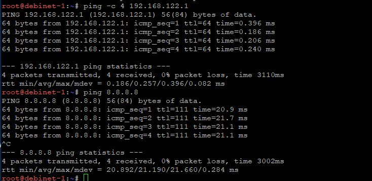

Dari hasil tersebut terlihat bahwa `rootkit` berhasil menerima balasan dari `192.168.122.1` dan `8.8.8.8`, sehingga koneksi dari router menuju jaringan luar telah berhasil.

Agar seluruh jaringan internal juga dapat mengakses internet, IP forwarding pada `rootkit` diaktifkan menggunakan:

```bash
sysctl -w net.ipv4.ip_forward=1
```

Kemudian dibuat aturan NAT masquerading:

```bash
iptables -t nat -A POSTROUTING -s 192.239.0.0/16 -o eth0 -j MASQUERADE
```

Aturan tersebut menyebabkan seluruh paket dari jaringan internal `192.239.x.x` diteruskan melalui interface `eth0` menuju jaringan luar.

Pada tahap awal konfigurasi, seluruh host non-router menggunakan resolver:

```bash
nameserver 192.168.122.1
```

yang ditambahkan pada:

```bash
/etc/resolv.conf
```

Dengan demikian seluruh Entitas dapat mengakses internet menggunakan IP address maupun melakukan instalasi package sebelum DNS internal selesai dibuat.

---

### 3. Memastikan Seluruh Entitas Dapat Saling Terhubung
---

Setelah seluruh IP address dan gateway dikonfigurasikan, langkah berikutnya adalah memastikan bahwa routing internal melalui `rootkit` dapat berjalan.

Karena masing-masing subnet terhubung langsung ke interface berbeda pada `rootkit`, maka komunikasi antarsubnet akan diteruskan melalui router tersebut.

Pengujian dapat dilakukan menggunakan:

```bash
ping <IP-tujuan>
```

atau setelah DNS aktif:

```bash
ping <hostname>.k56.com
```

Sebagai contoh dari `alpha` dilakukan pengujian ke beberapa host lain:

```bash
ping prab.k56.com
ping tedd.k56.com
ping abbey.k56.com
ping penny.k56.com
ping obladi.k56.com
ping desmond.k56.com
ping oblada.k56.com
ping molly.k56.com
ping delta.k56.com
ping epsilon.k56.com
```

Konfigurasi interface pada router dapat diperiksa menggunakan:

```bash
ip -br addr
```

Dokumentasi konfigurasi jaringan dapat dilihat pada gambar berikut.

.png)

Dari hasil pengujian, host yang berada pada subnet berbeda tetap dapat berkomunikasi satu sama lain. Hal ini membuktikan bahwa routing internal pada `rootkit` telah berjalan dengan benar.

---

### 4. Membangun DNS Authoritative pada Prab dan DNS Slave pada Tedd
---

Penjaga Direktori pada The Mesh menggunakan `prab` sebagai DNS authoritative master dan `tedd` sebagai DNS slave untuk domain:

```text
k56.com
```

BIND9 terlebih dahulu dipasang pada kedua node.

```bash
apt-get update
apt-get install bind9 dnsutils -y
```

## Konfigurasi DNS Master pada Prab

Pada `prab`, zona `k56.com` dideklarasikan melalui:

```bash
/etc/bind/named.conf.local
```

Konfigurasi yang digunakan:

```bash
zone "k56.com" {
    type master;
    file "/etc/bind/k56/k56.com";

    allow-transfer {
        192.239.1.3;
    };

    also-notify {
        192.239.1.3;
    };

    notify yes;
};
```

Direktori penyimpanan zone dibuat menggunakan:

```bash
mkdir -p /etc/bind/k56
```

Kemudian dibuat file:

```bash
nano /etc/bind/k56/k56.com
```

dengan isi:

```dns
$TTL 604800

@   IN  SOA prab.k56.com. root.k56.com. (
        2026092901
        604800
        86400
        2419200
        604800
)

@       IN  NS      prab.k56.com.
@       IN  NS      tedd.k56.com.

@       IN  A       192.239.3.2

prab    IN  A       192.239.1.2
tedd    IN  A       192.239.1.3
penny   IN  A       192.239.3.2
```

Bagian:

```dns
@ IN A 192.239.3.2
```

merupakan A record apex sehingga domain:

```text
k56.com
```

akan mengarah menuju node `penny`.

Selanjutnya forwarder DNS dikonfigurasi pada:

```bash
/etc/bind/named.conf.options
```

dengan:

```bash
options {
    directory "/var/cache/bind";

    forwarders {
        192.168.122.1;
    };

    allow-query { any; };

    recursion yes;
};
```

Konfigurasi BIND diperiksa menggunakan:

```bash
named-checkconf
```

Sedangkan file zone diperiksa menggunakan:

```bash
named-checkzone k56.com /etc/bind/k56/k56.com
```

Jika konfigurasi sudah benar, BIND direstart menggunakan:

```bash
service bind9 restart
```

#### Konfigurasi DNS Slave pada Tedd

Pada `tedd`, zona `k56.com` dideklarasikan sebagai slave.

```bash
nano /etc/bind/named.conf.local
```

Isi konfigurasi:

```bash
zone "k56.com" {
    type slave;
    masters { 192.239.1.2; };
    file "/var/cache/bind/k56.com";
};
```

Kemudian layanan BIND direstart:

```bash
service bind9 restart
```

Untuk memastikan `prab` menjawab secara authoritative digunakan:

```bash
dig @192.239.1.2 k56.com SOA
```

Sedangkan untuk menguji `tedd`:

```bash
dig @192.239.1.3 k56.com SOA
```

Hasil query menunjukkan flag:

```text
aa
```

yang berarti **Authoritative Answer**.

Dokumentasi pengujian dapat dilihat pada gambar berikut.

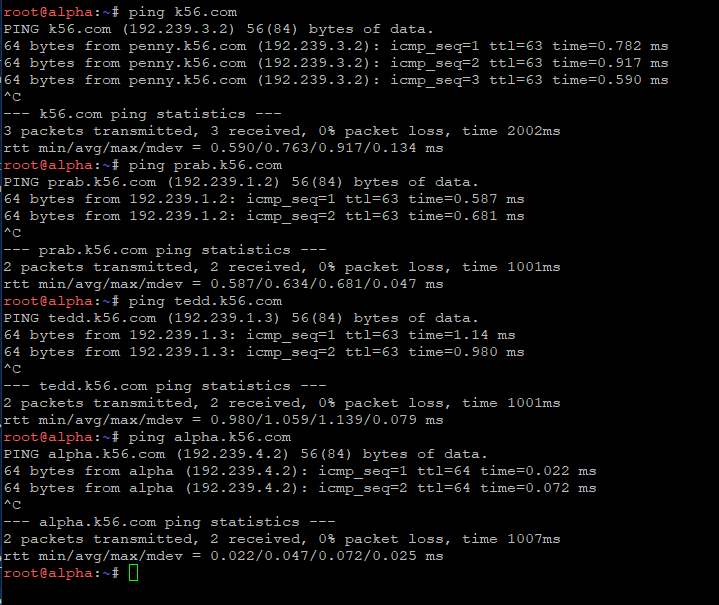

Setelah DNS internal aktif, urutan resolver pada seluruh Entitas non-router diubah menjadi:

```bash
nameserver 192.239.1.2
nameserver 192.239.1.3
nameserver 192.168.122.1
```

Dengan urutan tersebut:

- `192.239.1.2` adalah DNS utama `prab`
- `192.239.1.3` adalah DNS slave `tedd`
- `192.168.122.1` menjadi resolver eksternal

---

### 5. Memberikan Hostname dan Domain pada Seluruh Entitas
---

Seluruh Entitas kemudian diberi hostname sesuai glosarium, yaitu:

```text
rootkit
alpha
beta
gamma
delta
epsilon
prab
tedd
abbey
penny
obladi
desmond
oblada
molly
```

Hostname dapat dikonfigurasikan menggunakan:

```bash
hostnamectl set-hostname <nama-host>
```

Sebagai contoh pada node `alpha`:

```bash
hostnamectl set-hostname alpha
```

Hostname dapat diperiksa menggunakan:

```bash
hostname
```

Setelah itu dibuat domain untuk setiap node pada zone `k56.com`.

Pada file:

```bash
/etc/bind/k56/k56.com
```

ditambahkan:

```dns
alpha       IN A 192.239.4.2
beta        IN A 192.239.4.3
gamma       IN A 192.239.4.4

delta       IN A 192.239.5.2
epsilon     IN A 192.239.5.3

prab        IN A 192.239.1.2
tedd        IN A 192.239.1.3

abbey       IN A 192.239.2.2
penny       IN A 192.239.3.2

obladi      IN A 192.239.1.4
desmond     IN A 192.239.1.5
oblada      IN A 192.239.1.6
molly       IN A 192.239.1.7
```

Setiap kali terjadi perubahan zone, serial SOA harus dinaikkan.

Sebagai contoh:

```dns
2026092902
```

Setelah perubahan dilakukan:

```bash
named-checkzone k56.com /etc/bind/k56/k56.com
```

Kemudian:

```bash
service bind9 restart
```

Pengujian dilakukan dari salah satu client, misalnya `alpha`.

```bash
ping tedd.k56.com
ping obladi.k56.com
ping desmond.k56.com
ping oblada.k56.com
ping molly.k56.com
```

Hasil pengujian:

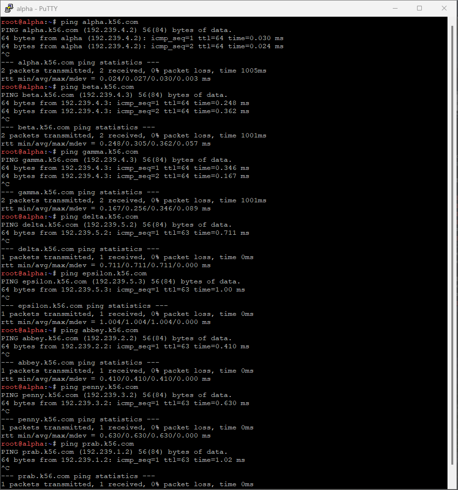

Selanjutnya dilakukan pengujian terhadap node lainnya.

```bash
ping alpha.k56.com
ping beta.k56.com
ping gamma.k56.com
ping delta.k56.com
ping epsilon.k56.com
ping abbey.k56.com
ping penny.k56.com
ping prab.k56.com
```

Hasil pengujian:

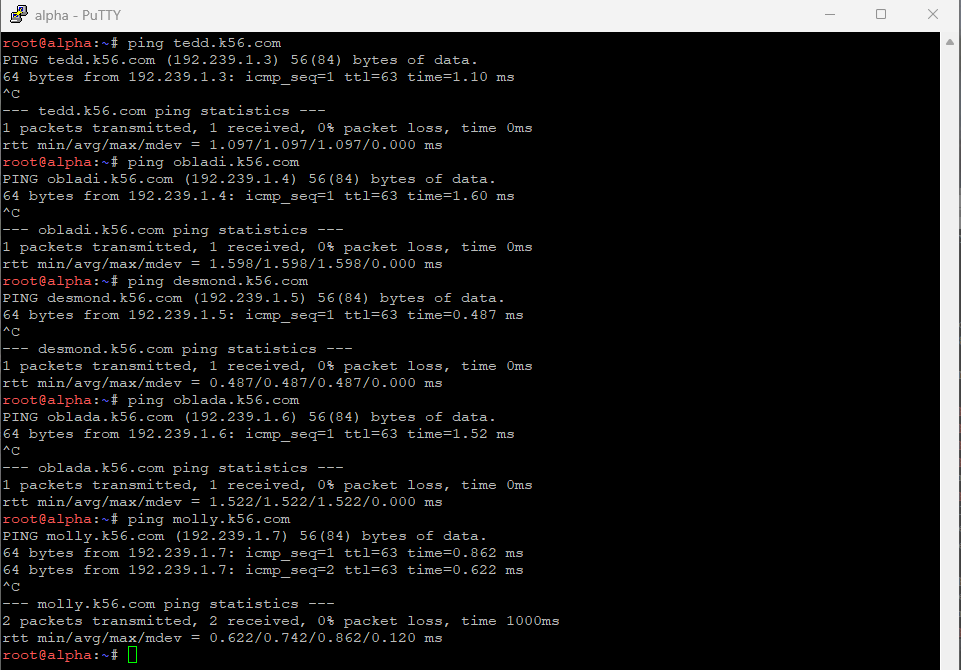

Dari hasil tersebut terlihat bahwa hostname setiap Entitas dapat diterjemahkan menjadi IP address yang sesuai dan dapat dikenali secara system-wide.

---

### 6. Memastikan Zone Transfer Berjalan dari Prab ke Tedd
---

Setelah seluruh record pada DNS master selesai dibuat, perlu dipastikan bahwa `tedd` mendapatkan salinan terbaru dari zone `k56.com`.

Pada `prab`, konfigurasi zone telah mengizinkan transfer menuju:

```text
192.239.1.3
```

melalui:

```bash
allow-transfer { 192.239.1.3; };
```

dan:

```bash
also-notify { 192.239.1.3; };
```

Setelah file zone diperbarui, serial SOA dinaikkan kemudian BIND direload menggunakan:

```bash
rndc reload
```

atau:

```bash
service bind9 restart
```

Pada `tedd`, hasil transfer zone dapat diperiksa menggunakan:

```bash
ls -l /var/cache/bind/
```

Hasilnya menunjukkan terdapat file zone:

```text
k56.com
```

Dokumentasi hasil zone transfer dapat dilihat pada gambar berikut.

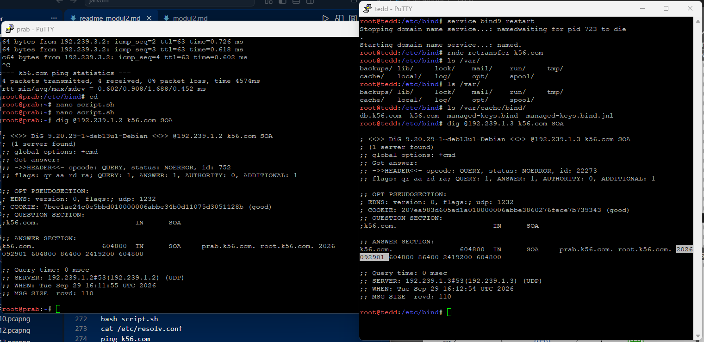

Selanjutnya dilakukan pengecekan serial SOA pada master:

```bash
dig @192.239.1.2 k56.com SOA
```

dan pada slave:

```bash
dig @192.239.1.3 k56.com SOA
```

Serial SOA pada kedua server harus sama.

Jika `prab` dan `tedd` menunjukkan serial yang sama, maka dapat disimpulkan bahwa zone transfer berjalan dengan benar dan `tedd` telah menerima salinan terbaru dari zone milik `prab`.

---

### 7. Konfigurasi Vault, Core, WWW, dan Static
---

Selanjutnya ditambahkan hostname khusus untuk layanan web.

Node area `vault` adalah:

```text
obladi   192.239.1.4
desmond  192.239.1.5
```

Node area `core` adalah:

```text
oblada   192.239.1.6
molly    192.239.1.7
```

Sementara itu:

```text
www.k56.com
```

harus menjadi alias dari:

```text
penny.k56.com
```

dan:

```text
static.k56.com
```

harus menjadi alias dari:

```text
abbey.k56.com
```

Pada file:

```bash
/etc/bind/k56/k56.com
```

ditambahkan:

```dns
vault       IN A       192.239.1.4
vault       IN A       192.239.1.5

core        IN A       192.239.1.6
core        IN A       192.239.1.7

www         IN CNAME   penny.k56.com.
static      IN CNAME   abbey.k56.com.
```

Karena `vault` mempunyai dua A record, maka:

```text
vault.k56.com
```

dapat mengarah ke `obladi` maupun `desmond`.

Begitu juga dengan:

```text
core.k56.com
```

yang dapat mengarah ke `oblada` maupun `molly`.

Setelah record ditambahkan, serial SOA dinaikkan.

Kemudian dilakukan pengecekan:

```bash
named-checkzone k56.com /etc/bind/k56/k56.com
```

dan BIND direstart:

```bash
service bind9 restart
```

Pengujian dapat dilakukan menggunakan:

```bash
dig vault.k56.com
dig core.k56.com
dig www.k56.com
dig static.k56.com
```

atau:

```bash
ping vault.k56.com
ping core.k56.com
ping www.k56.com
ping static.k56.com
```

Pengujian dilakukan dari dua client berbeda untuk memastikan bahwa seluruh hostname memberikan hasil resolusi yang konsisten.

Dokumentasi pengujian:

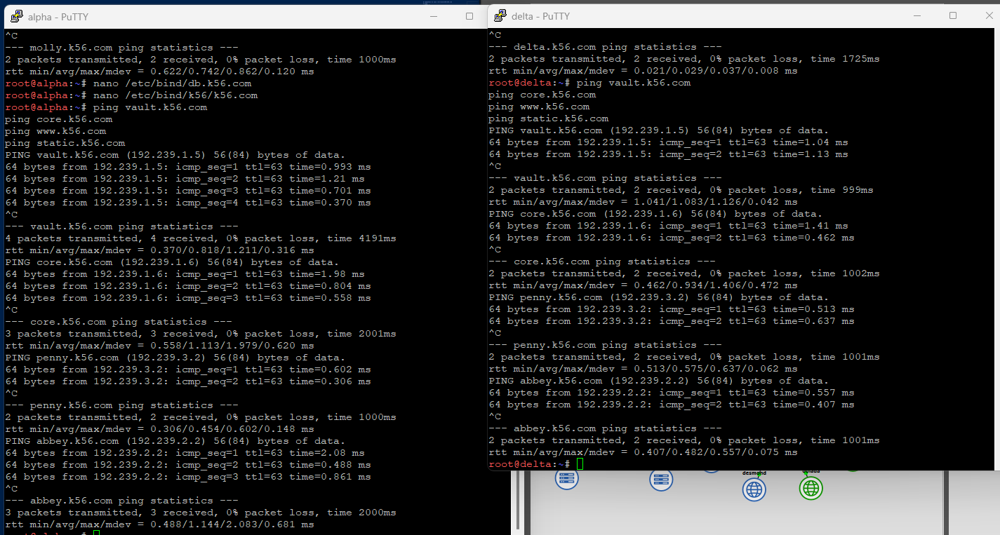

Dari hasil tersebut dapat diketahui bahwa:

- `vault.k56.com` mengarah ke area web statis
- `core.k56.com` mengarah ke area web dinamis
- `www.k56.com` merupakan alias `penny.k56.com`
- `static.k56.com` merupakan alias `abbey.k56.com`

---

### 8. Konfigurasi Reverse DNS
---

Selain forward DNS, dibuat reverse DNS agar alamat IP dapat diterjemahkan kembali menjadi hostname.

Reverse DNS dibuat untuk subnet yang memiliki `abbey`, `penny`, area `vault`, dan area `core`.

Subnet tersebut adalah:

```text
192.239.1.0/24
192.239.2.0/24
192.239.3.0/24
```

Pada `prab`, reverse zone dideklarasikan pada:

```bash
/etc/bind/named.conf.local
```

dengan:

```bash
zone "1.239.192.in-addr.arpa" {
    type master;
    file "/etc/bind/k56/rev.192.239.1";
    allow-transfer { 192.239.1.3; };
    also-notify { 192.239.1.3; };
};

zone "2.239.192.in-addr.arpa" {
    type master;
    file "/etc/bind/k56/rev.192.239.2";
    allow-transfer { 192.239.1.3; };
    also-notify { 192.239.1.3; };
};

zone "3.239.192.in-addr.arpa" {
    type master;
    file "/etc/bind/k56/rev.192.239.3";
    allow-transfer { 192.239.1.3; };
    also-notify { 192.239.1.3; };
};
```

#### Reverse Zone 192.239.1.0/24

File:

```bash
/etc/bind/k56/rev.192.239.1
```

diisi:

```dns
$TTL 604800

@ IN SOA prab.k56.com. root.k56.com. (
    2026092901
    604800
    86400
    2419200
    604800
)

@ IN NS prab.k56.com.
@ IN NS tedd.k56.com.

4 IN PTR vault.k56.com.
5 IN PTR vault.k56.com.
6 IN PTR core.k56.com.
7 IN PTR core.k56.com.
```

Dengan konfigurasi tersebut:

```text
192.239.1.4 -> vault.k56.com
192.239.1.5 -> vault.k56.com
192.239.1.6 -> core.k56.com
192.239.1.7 -> core.k56.com
```

#### Reverse Zone 192.239.2.0/24

File:

```bash
/etc/bind/k56/rev.192.239.2
```

diisi:

```dns
$TTL 604800

@ IN SOA prab.k56.com. root.k56.com. (
    2026092901
    604800
    86400
    2419200
    604800
)

@ IN NS prab.k56.com.
@ IN NS tedd.k56.com.

2 IN PTR abbey.k56.com.
```

Sehingga:

```text
192.239.2.2 -> abbey.k56.com
```

#### Reverse Zone 192.239.3.0/24

File:

```bash
/etc/bind/k56/rev.192.239.3
```

diisi:

```dns
$TTL 604800

@ IN SOA prab.k56.com. root.k56.com. (
    2026092901
    604800
    86400
    2419200
    604800
)

@ IN NS prab.k56.com.
@ IN NS tedd.k56.com.

2 IN PTR penny.k56.com.
```

Sehingga:

```text
192.239.3.2 -> penny.k56.com
```

Setelah konfigurasi selesai, dilakukan pengecekan:

```bash
named-checkconf
```

Kemudian:

```bash
named-checkzone 1.239.192.in-addr.arpa /etc/bind/k56/rev.192.239.1
named-checkzone 2.239.192.in-addr.arpa /etc/bind/k56/rev.192.239.2
named-checkzone 3.239.192.in-addr.arpa /etc/bind/k56/rev.192.239.3
```

Setelah itu:

```bash
service bind9 restart
```

Pada `tedd`, reverse zone dikonfigurasikan sebagai slave.

```bash
zone "1.239.192.in-addr.arpa" {
    type slave;
    masters { 192.239.1.2; };
    file "/var/cache/bind/rev.192.239.1";
};

zone "2.239.192.in-addr.arpa" {
    type slave;
    masters { 192.239.1.2; };
    file "/var/cache/bind/rev.192.239.2";
};

zone "3.239.192.in-addr.arpa" {
    type slave;
    masters { 192.239.1.2; };
    file "/var/cache/bind/rev.192.239.3";
};
```

Kemudian:

```bash
service bind9 restart
```

Pengujian reverse DNS pada `prab` dilakukan menggunakan:

```bash
dig @192.239.1.2 -x 192.239.1.4
dig @192.239.1.2 -x 192.239.1.5
```

Hasilnya menunjukkan:

```text
192.239.1.4 -> vault.k56.com
192.239.1.5 -> vault.k56.com
```

Dokumentasi:

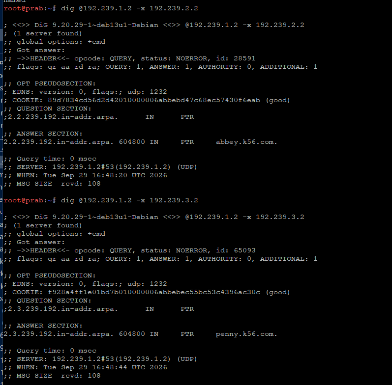

Kemudian dilakukan pengujian:

```bash
dig @192.239.1.2 -x 192.239.2.2
dig @192.239.1.2 -x 192.239.3.2
```

Hasilnya:

```text
192.239.2.2 -> abbey.k56.com
192.239.3.2 -> penny.k56.com
```

Dokumentasi:

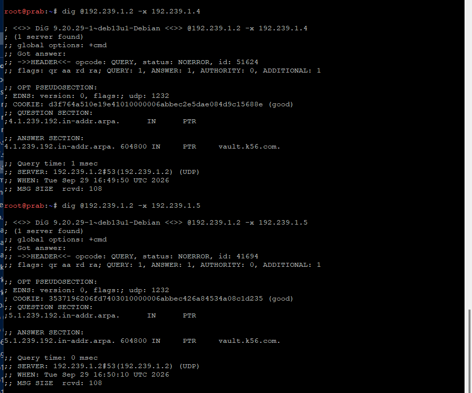

Pengujian area core dilakukan menggunakan:

```bash
dig @192.239.1.2 -x 192.239.1.6
dig @192.239.1.2 -x 192.239.1.7
```

Hasilnya:

```text
192.239.1.6 -> core.k56.com
192.239.1.7 -> core.k56.com
```

Dokumentasi:

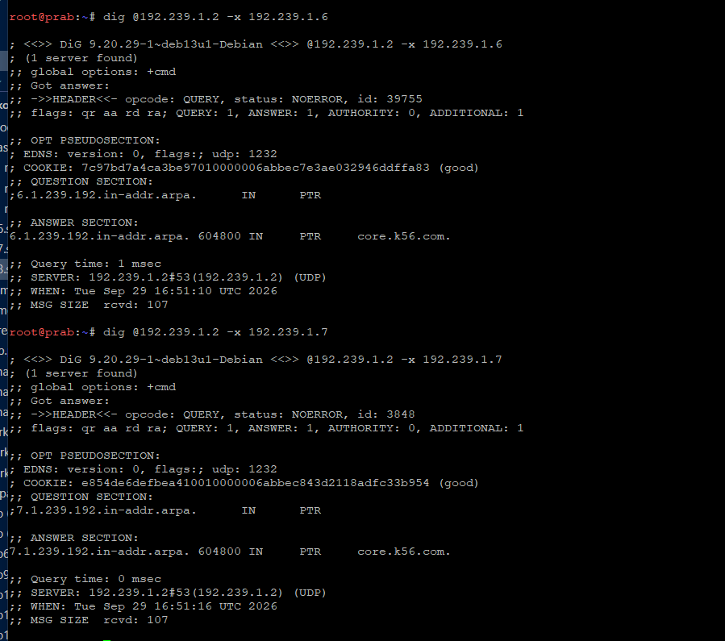

Pengujian kemudian dilakukan melalui DNS slave `tedd`.

```bash
dig @192.239.1.3 -x 192.239.2.2
```

Dokumentasi:

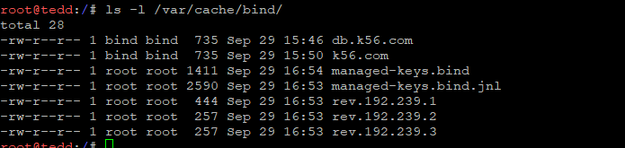

Kemudian:

```bash
dig @192.239.1.3 -x 192.239.3.2
```

Dokumentasi:

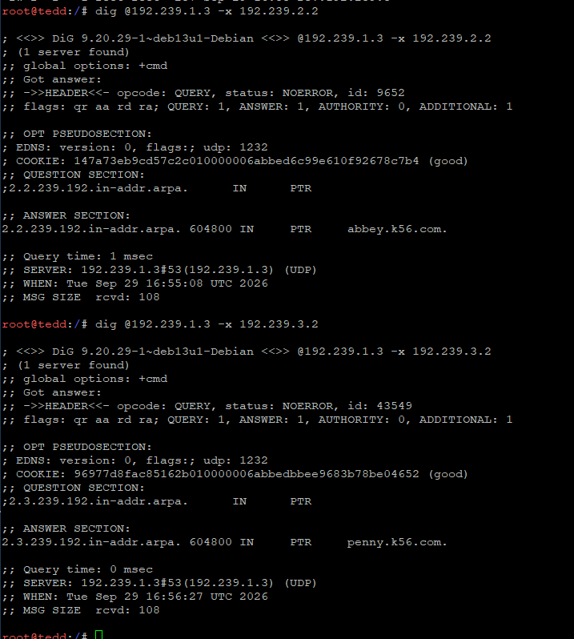

Dari hasil query terlihat bahwa `prab` maupun `tedd` dapat menjawab reverse query secara authoritative.

---

### 9. Menjalankan Web Statis pada Area Vault Menggunakan Apache
---

Node `obladi` dan `desmond` digunakan sebagai server web statis untuk:

```text
vault.k56.com
```

Apache2 terlebih dahulu dipasang pada kedua node.

```bash
apt-get update
apt-get install apache2 -y
```

Direktori web dibuat menggunakan:

```bash
mkdir -p /var/www/vault/arsip
```

Kemudian beberapa file pengujian dibuat di dalam folder `/arsip/`.

Contoh:

```bash
echo "dokumen pertama" > /var/www/vault/arsip/dokumen1.txt
echo "dokumen kedua" > /var/www/vault/arsip/dokumen2.txt
echo "dokumen tambahan" > /var/www/vault/arsip/dokumenB.txt
```

Selanjutnya dibuat virtual host Apache:

```bash
nano /etc/apache2/sites-available/vault.conf
```

dengan konfigurasi:

```apache
<VirtualHost *:80>
    ServerName vault.k56.com

    DocumentRoot /var/www/vault

    <Directory /var/www/vault>
        Options Indexes FollowSymLinks
        AllowOverride None
        Require all granted
    </Directory>

    <Directory /var/www/vault/arsip>
        Options +Indexes
        Require all granted
    </Directory>
</VirtualHost>
```

Bagian:

```apache
Options +Indexes
```

digunakan untuk mengaktifkan fitur autoindex atau directory listing.

Virtual host kemudian diaktifkan:

```bash
a2ensite vault.conf
```

Konfigurasi default dapat dinonaktifkan:

```bash
a2dissite 000-default.conf
```

Setelah itu Apache direload:

```bash
service apache2 reload
```

Karena soal meminta pengujian dilakukan menggunakan hostname, maka pengujian dilakukan dengan:

```bash
curl http://vault.k56.com/
```

Dokumentasi:

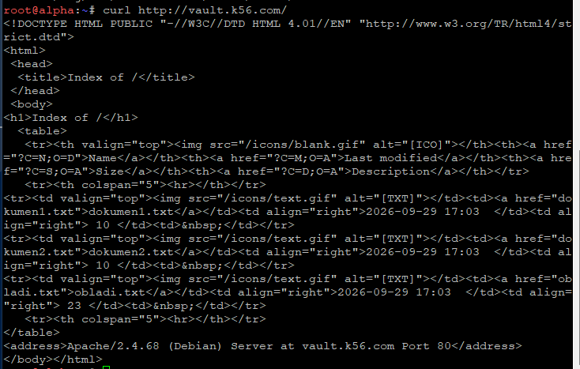

Selanjutnya dilakukan pengujian directory listing:

```bash
curl http://vault.k56.com/arsip/
```

Dokumentasi:

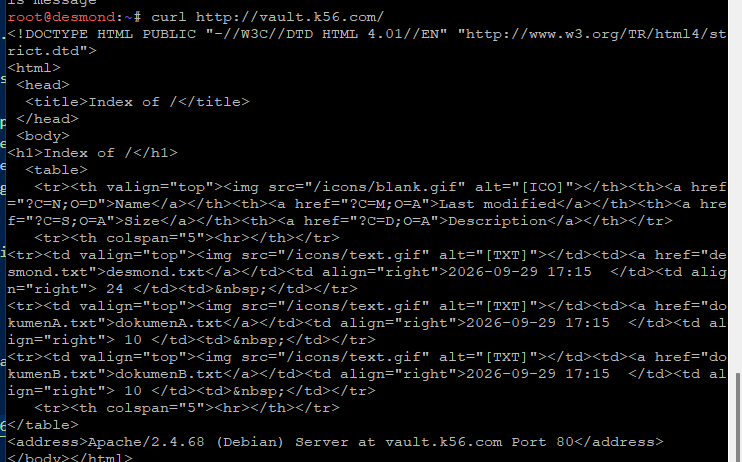

Pada output terlihat halaman:

```text
Index of /arsip
```

beserta file-file di dalam direktori tersebut.

Hal ini membuktikan bahwa Apache berhasil berjalan menggunakan hostname `vault.k56.com` dan fitur autoindex pada folder `/arsip/` telah aktif.

---

### 10. Menjalankan Web Dinamis pada Area Core Menggunakan Nginx dan PHP-FPM
---

Node `oblada` dan `molly` digunakan sebagai web server dinamis untuk hostname:

```text
core.k56.com
```

Pada kedua node digunakan:

- Nginx sebagai web server
- PHP-FPM sebagai pemroses file PHP

Package dipasang menggunakan:

```bash
apt-get update
apt-get install nginx php-fpm -y
```

Kemudian PHP-FPM dijalankan.

Pada praktikum digunakan PHP 8.4:

```bash
service php8.4-fpm start
```

Direktori aplikasi dibuat:

```bash
mkdir -p /var/www/core
```

## Membuat Halaman Beranda pada Oblada

Pada `oblada`:

```bash
nano /var/www/core/index.php
```

Isi:

```php
<?php
echo "<h1>CORE - OBLADA</h1>";
echo "<p>Selamat datang di core.k56.com</p>";
echo '<a href="/profil">Ke Halaman Profil</a>';
?>
```

## Membuat Halaman Profil pada Oblada

```bash
nano /var/www/core/profil.php
```

Isi:

```php
<?php
echo "<h1>PROFIL - OBLADA</h1>";
echo "<p>Ini adalah halaman profil dari server Oblada.</p>";
echo '<a href="/">Kembali ke Beranda</a>';
?>
```

## Membuat Halaman Beranda pada Molly

Pada `molly`:

```bash
nano /var/www/core/index.php
```

Isi:

```php
<?php
echo "<h1>CORE - MOLLY</h1>";
echo "<p>Selamat datang di core.k56.com</p>";
echo '<a href="/profil">Ke Halaman Profil</a>';
?>
```

## Membuat Halaman Profil pada Molly

```bash
nano /var/www/core/profil.php
```

Isi:

```php
<?php
echo "<h1>PROFIL - MOLLY</h1>";
echo "<p>Ini adalah halaman profil dari server Molly.</p>";
echo '<a href="/">Kembali ke Beranda</a>';
?>
```

Selanjutnya dibuat virtual host Nginx pada:

```bash
nano /etc/nginx/sites-available/core
```

dengan konfigurasi:

```nginx
server {
    listen 80;

    server_name core.k56.com;

    root /var/www/core;
    index index.php index.html;

    location / {
        try_files $uri $uri/ $uri.php?$query_string;
    }

    location ~ \.php$ {
        include snippets/fastcgi-php.conf;
        fastcgi_pass unix:/run/php/php8.4-fpm.sock;
    }
}
```

Bagian penting dari konfigurasi tersebut adalah:

```nginx
try_files $uri $uri/ $uri.php?$query_string;
```

Konfigurasi tersebut membuat request:

```text
/profil
```

dapat diarahkan secara internal menuju:

```text
/profil.php
```

sehingga pengguna dapat mengakses halaman menggunakan URL bersih tanpa ekstensi `.php`.

Kemudian konfigurasi diaktifkan:

```bash
ln -s /etc/nginx/sites-available/core /etc/nginx/sites-enabled/core
```

Konfigurasi default Nginx dapat dihapus:

```bash
rm -f /etc/nginx/sites-enabled/default
```

Selanjutnya diperiksa menggunakan:

```bash
nginx -t
```

Jika konfigurasi berhasil:

```bash
service nginx restart
```

dan:

```bash
service php8.4-fpm restart
```

## Pengujian Lokal Menggunakan Host Header

Sebelum melakukan pengujian dari client, server dapat diuji secara lokal menggunakan `Host` header.

Pada `molly`:

```bash
curl -H "Host: core.k56.com" http://127.0.0.1/
```

Hasilnya:

```html
<h1>CORE - MOLLY</h1>
<p>Selamat datang di core.k56.com</p>
<a href="/profil">Ke Halaman Profil</a>
```

Kemudian halaman `/profil` diuji menggunakan:

```bash
curl -H "Host: core.k56.com" http://127.0.0.1/profil
```

Hasilnya:

```html
<h1>PROFIL - MOLLY</h1>
<p>Ini adalah halaman profil dari server Molly.</p>
<a href="/">Kembali ke Beranda</a>
```

Dokumentasi:

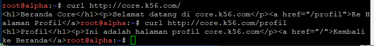

Dari hasil tersebut dapat diketahui bahwa virtual host `core.k56.com`, PHP-FPM, dan rewrite URL telah berjalan dengan benar.

## Pengujian Menggunakan Hostname

Karena pada soal disebutkan bahwa **akses pengujian wajib dilakukan melalui hostname**, maka pengujian utama dilakukan dari client dengan:

```bash
curl http://core.k56.com/
```

Kemudian:

```bash
curl http://core.k56.com/profil
```

Hasil pengujian:

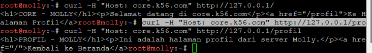

Terlihat bahwa halaman profil dapat diakses melalui:

```text
http://core.k56.com/profil
```

tanpa perlu menambahkan:

```text
.php
```

Dengan demikian konfigurasi rewrite telah berhasil.

## Pengujian Backend Oblada dan Molly Secara Terpisah

Karena `core.k56.com` memiliki dua A record:

```dns
core    IN A    192.239.1.6
core    IN A    192.239.1.7
```

maka kedua server dapat diuji secara spesifik menggunakan `curl --resolve`.

Untuk memastikan `oblada` melayani hostname `core.k56.com`:

```bash
curl --resolve core.k56.com:80:192.239.1.6 http://core.k56.com/
```

Kemudian halaman profil:

```bash
curl --resolve core.k56.com:80:192.239.1.6 http://core.k56.com/profil
```

Untuk memastikan `molly` melayani hostname yang sama:

```bash
curl --resolve core.k56.com:80:192.239.1.7 http://core.k56.com/
```

Kemudian:

```bash
curl --resolve core.k56.com:80:192.239.1.7 http://core.k56.com/profil
```

Dokumentasi tambahan pengujian:

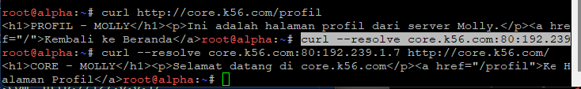

Dengan pengujian ini dapat dibuktikan bahwa `oblada` dan `molly` sama-sama berfungsi sebagai backend untuk hostname `core.k56.com`.
