# Jarkom-Modul-2-2026-K-56

| No  | Nama                           | NRP        | Pengerjaan |
| --- | ------------------------------ | ---------- | ---------- |
| 1   | Sahira Bilqis Rivadito         | 5027251037 | No 1-10    |
| 2   | Muhammmad Ridwan               | 5027251113 | No 11-20   |

## LAPORAN RESMI MODUL 2

### 1. Topologi Jaringan dan Pembagian IP Address
---

Sebagai pusat kesadaran **The Mesh**, `rootkit` berperan sebagai router utama yang menghubungkan seluruh Entitas di dalam jaringan. Router `rootkit` terhubung ke NAT sebagai jalur menuju jaringan luar dan juga terhubung ke lima switch yang membagi jaringan menjadi lima segmen.

Topologi yang digunakan dapat dilihat pada gambar berikut.


Pembagian subnet pada topologi adalah sebagai berikut.

| Segmen | Network | Gateway | Host |
|---|---|---|---|
| Switch 1 | `192.239.1.0/24` | `192.239.1.1` | prab, tedd, obladi, desmond, oblada, molly |
| Switch 2 | `192.239.2.0/24` | `192.239.2.1` | abbey |
| Switch 3 | `192.239.3.0/24` | `192.239.3.1` | penny |
| Switch 4 | `192.239.4.0/24` | `192.239.4.1` | alpha, beta, gamma |
| Switch 5 | `192.239.5.0/24` | `192.239.5.1` | delta, epsilon |

Pembagian IP setiap Entitas adalah sebagai berikut.

| Host | IP Address | Gateway |
|---|---|---|
| rootkit eth1 | `192.239.1.1/24` | - |
| rootkit eth2 | `192.239.2.1/24` | - |
| rootkit eth3 | `192.239.3.1/24` | - |
| rootkit eth4 | `192.239.4.1/24` | - |
| rootkit eth5 | `192.239.5.1/24` | - |
| prab | `192.239.1.2/24` | `192.239.1.1` |
| tedd | `192.239.1.3/24` | `192.239.1.1` |
| obladi | `192.239.1.4/24` | `192.239.1.1` |
| desmond | `192.239.1.5/24` | `192.239.1.1` |
| oblada | `192.239.1.6/24` | `192.239.1.1` |
| molly | `192.239.1.7/24` | `192.239.1.1` |
| abbey | `192.239.2.2/24` | `192.239.2.1` |
| penny | `192.239.3.2/24` | `192.239.3.1` |
| alpha | `192.239.4.2/24` | `192.239.4.1` |
| beta | `192.239.4.3/24` | `192.239.4.1` |
| gamma | `192.239.4.4/24` | `192.239.4.1` |
| delta | `192.239.5.2/24` | `192.239.5.1` |
| epsilon | `192.239.5.3/24` | `192.239.5.1` |

Konfigurasi interface pada `rootkit` diletakkan pada file:

```bash
/etc/network/interfaces
```

dengan konfigurasi:

```bash
auto eth0
iface eth0 inet dhcp

auto eth1
iface eth1 inet static
    address 192.239.1.1
    netmask 255.255.255.0

auto eth2
iface eth2 inet static
    address 192.239.2.1
    netmask 255.255.255.0

auto eth3
iface eth3 inet static
    address 192.239.3.1
    netmask 255.255.255.0

auto eth4
iface eth4 inet static
    address 192.239.4.1
    netmask 255.255.255.0

auto eth5
iface eth5 inet static
    address 192.239.5.1
    netmask 255.255.255.0
```

Sedangkan setiap host non-router dikonfigurasikan dengan IP statis dan gateway sesuai subnetnya.

Contoh konfigurasi `alpha`:

```bash
auto eth0
iface eth0 inet static
    address 192.239.4.2
    netmask 255.255.255.0
    gateway 192.239.4.1
```

Contoh konfigurasi `penny`:

```bash
auto eth0
iface eth0 inet static
    address 192.239.3.2
    netmask 255.255.255.0
    gateway 192.239.3.1
```

Contoh konfigurasi `abbey`:

```bash
auto eth0
iface eth0 inet static
    address 192.239.2.2
    netmask 255.255.255.0
    gateway 192.239.2.1
```

Dengan konfigurasi tersebut, setiap Entitas memiliki IP address dan default gateway sesuai dengan topologi yang telah dirancang.

---

### 2. Menghubungkan Rootkit dan Seluruh Entitas ke Internet
---

Meskipun The Mesh beroperasi pada jaringan internal, seluruh Entitas tetap membutuhkan akses menuju jaringan luar untuk mengunduh package dan kebutuhan instalasi lainnya.

Untuk itu, interface WAN `eth0` pada `rootkit` dikonfigurasikan agar memperoleh IP secara dinamis dari NAT.

```bash
auto eth0
iface eth0 inet dhcp
```

Setelah interface aktif, konfigurasi IP pada `rootkit` diperiksa menggunakan:

```bash
ip -br addr
```

Dari hasil konfigurasi terlihat bahwa `rootkit` memiliki interface internal:

```text
eth1  192.239.1.1/24
eth2  192.239.2.1/24
eth3  192.239.3.1/24
eth4  192.239.4.1/24
eth5  192.239.5.1/24
```

Sedangkan interface `eth0` memperoleh alamat IP secara dinamis dari NAT.

Pengujian konektivitas menuju gateway NAT dilakukan dengan:

```bash
ping -c 4 192.168.122.1
```

Kemudian dilakukan pengujian akses internet menggunakan alamat IP publik:

```bash
ping 8.8.8.8
```

Hasil pengujian dapat dilihat pada gambar berikut.


Dari hasil tersebut terlihat bahwa `rootkit` berhasil menerima balasan dari `192.168.122.1` dan `8.8.8.8`, sehingga koneksi dari router menuju jaringan luar telah berhasil.

Agar seluruh jaringan internal juga dapat mengakses internet, IP forwarding pada `rootkit` diaktifkan menggunakan:

```bash
sysctl -w net.ipv4.ip_forward=1
```

Kemudian dibuat aturan NAT masquerading:

```bash
iptables -t nat -A POSTROUTING -s 192.239.0.0/16 -o eth0 -j MASQUERADE
```

Aturan tersebut menyebabkan seluruh paket dari jaringan internal `192.239.x.x` diteruskan melalui interface `eth0` menuju jaringan luar.

Pada tahap awal konfigurasi, seluruh host non-router menggunakan resolver:

```bash
nameserver 192.168.122.1
```

yang ditambahkan pada:

```bash
/etc/resolv.conf
```

Dengan demikian seluruh Entitas dapat mengakses internet menggunakan IP address maupun melakukan instalasi package sebelum DNS internal selesai dibuat.

---

### 3. Memastikan Seluruh Entitas Dapat Saling Terhubung
---

Setelah seluruh IP address dan gateway dikonfigurasikan, langkah berikutnya adalah memastikan bahwa routing internal melalui `rootkit` dapat berjalan.

Karena masing-masing subnet terhubung langsung ke interface berbeda pada `rootkit`, maka komunikasi antarsubnet akan diteruskan melalui router tersebut.

Pengujian dapat dilakukan menggunakan:

```bash
ping <IP-tujuan>
```

atau setelah DNS aktif:

```bash
ping <hostname>.k56.com
```

Sebagai contoh dari `alpha` dilakukan pengujian ke beberapa host lain:

```bash
ping prab.k56.com
ping tedd.k56.com
ping abbey.k56.com
ping penny.k56.com
ping obladi.k56.com
ping desmond.k56.com
ping oblada.k56.com
ping molly.k56.com
ping delta.k56.com
ping epsilon.k56.com
```

Konfigurasi interface pada router dapat diperiksa menggunakan:

```bash
ip -br addr
```

Dokumentasi konfigurasi jaringan dapat dilihat pada gambar berikut.

.png)

Dari hasil pengujian, host yang berada pada subnet berbeda tetap dapat berkomunikasi satu sama lain. Hal ini membuktikan bahwa routing internal pada `rootkit` telah berjalan dengan benar.

---

### 4. Membangun DNS Authoritative pada Prab dan DNS Slave pada Tedd
---

Penjaga Direktori pada The Mesh menggunakan `prab` sebagai DNS authoritative master dan `tedd` sebagai DNS slave untuk domain:

```text
k56.com
```

BIND9 terlebih dahulu dipasang pada kedua node.

```bash
apt-get update
apt-get install bind9 dnsutils -y
```

## Konfigurasi DNS Master pada Prab

Pada `prab`, zona `k56.com` dideklarasikan melalui:

```bash
/etc/bind/named.conf.local
```

Konfigurasi yang digunakan:

```bash
zone "k56.com" {
    type master;
    file "/etc/bind/k56/k56.com";

    allow-transfer {
        192.239.1.3;
    };

    also-notify {
        192.239.1.3;
    };

    notify yes;
};
```

Direktori penyimpanan zone dibuat menggunakan:

```bash
mkdir -p /etc/bind/k56
```

Kemudian dibuat file:

```bash
nano /etc/bind/k56/k56.com
```

dengan isi:

```dns
$TTL 604800

@   IN  SOA prab.k56.com. root.k56.com. (
        2026092901
        604800
        86400
        2419200
        604800
)

@       IN  NS      prab.k56.com.
@       IN  NS      tedd.k56.com.

@       IN  A       192.239.3.2

prab    IN  A       192.239.1.2
tedd    IN  A       192.239.1.3
penny   IN  A       192.239.3.2
```

Bagian:

```dns
@ IN A 192.239.3.2
```

merupakan A record apex sehingga domain:

```text
k56.com
```

akan mengarah menuju node `penny`.

Selanjutnya forwarder DNS dikonfigurasi pada:

```bash
/etc/bind/named.conf.options
```

dengan:

```bash
options {
    directory "/var/cache/bind";

    forwarders {
        192.168.122.1;
    };

    allow-query { any; };

    recursion yes;
};
```

Konfigurasi BIND diperiksa menggunakan:

```bash
named-checkconf
```

Sedangkan file zone diperiksa menggunakan:

```bash
named-checkzone k56.com /etc/bind/k56/k56.com
```

Jika konfigurasi sudah benar, BIND direstart menggunakan:

```bash
service bind9 restart
```

#### Konfigurasi DNS Slave pada Tedd

Pada `tedd`, zona `k56.com` dideklarasikan sebagai slave.

```bash
nano /etc/bind/named.conf.local
```

Isi konfigurasi:

```bash
zone "k56.com" {
    type slave;
    masters { 192.239.1.2; };
    file "/var/cache/bind/k56.com";
};
```

Kemudian layanan BIND direstart:

```bash
service bind9 restart
```

Untuk memastikan `prab` menjawab secara authoritative digunakan:

```bash
dig @192.239.1.2 k56.com SOA
```

Sedangkan untuk menguji `tedd`:

```bash
dig @192.239.1.3 k56.com SOA
```

Hasil query menunjukkan flag:

```text
aa
```

yang berarti **Authoritative Answer**.

Dokumentasi pengujian dapat dilihat pada gambar berikut.


Setelah DNS internal aktif, urutan resolver pada seluruh Entitas non-router diubah menjadi:

```bash
nameserver 192.239.1.2
nameserver 192.239.1.3
nameserver 192.168.122.1
```

Dengan urutan tersebut:

- `192.239.1.2` adalah DNS utama `prab`
- `192.239.1.3` adalah DNS slave `tedd`
- `192.168.122.1` menjadi resolver eksternal

---

### 5. Memberikan Hostname dan Domain pada Seluruh Entitas
---

Seluruh Entitas kemudian diberi hostname sesuai glosarium, yaitu:

```text
rootkit
alpha
beta
gamma
delta
epsilon
prab
tedd
abbey
penny
obladi
desmond
oblada
molly
```

Hostname dapat dikonfigurasikan menggunakan:

```bash
hostnamectl set-hostname <nama-host>
```

Sebagai contoh pada node `alpha`:

```bash
hostnamectl set-hostname alpha
```

Hostname dapat diperiksa menggunakan:

```bash
hostname
```

Setelah itu dibuat domain untuk setiap node pada zone `k56.com`.

Pada file:

```bash
/etc/bind/k56/k56.com
```

ditambahkan:

```dns
alpha       IN A 192.239.4.2
beta        IN A 192.239.4.3
gamma       IN A 192.239.4.4

delta       IN A 192.239.5.2
epsilon     IN A 192.239.5.3

prab        IN A 192.239.1.2
tedd        IN A 192.239.1.3

abbey       IN A 192.239.2.2
penny       IN A 192.239.3.2

obladi      IN A 192.239.1.4
desmond     IN A 192.239.1.5
oblada      IN A 192.239.1.6
molly       IN A 192.239.1.7
```

Setiap kali terjadi perubahan zone, serial SOA harus dinaikkan.

Sebagai contoh:

```dns
2026092902
```

Setelah perubahan dilakukan:

```bash
named-checkzone k56.com /etc/bind/k56/k56.com
```

Kemudian:

```bash
service bind9 restart
```

Pengujian dilakukan dari salah satu client, misalnya `alpha`.

```bash
ping tedd.k56.com
ping obladi.k56.com
ping desmond.k56.com
ping oblada.k56.com
ping molly.k56.com
```

Hasil pengujian:


Selanjutnya dilakukan pengujian terhadap node lainnya.

```bash
ping alpha.k56.com
ping beta.k56.com
ping gamma.k56.com
ping delta.k56.com
ping epsilon.k56.com
ping abbey.k56.com
ping penny.k56.com
ping prab.k56.com
```

Hasil pengujian:


Dari hasil tersebut terlihat bahwa hostname setiap Entitas dapat diterjemahkan menjadi IP address yang sesuai dan dapat dikenali secara system-wide.

---

### 6. Memastikan Zone Transfer Berjalan dari Prab ke Tedd
---

Setelah seluruh record pada DNS master selesai dibuat, perlu dipastikan bahwa `tedd` mendapatkan salinan terbaru dari zone `k56.com`.

Pada `prab`, konfigurasi zone telah mengizinkan transfer menuju:

```text
192.239.1.3
```

melalui:

```bash
allow-transfer { 192.239.1.3; };
```

dan:

```bash
also-notify { 192.239.1.3; };
```

Setelah file zone diperbarui, serial SOA dinaikkan kemudian BIND direload menggunakan:

```bash
rndc reload
```

atau:

```bash
service bind9 restart
```

Pada `tedd`, hasil transfer zone dapat diperiksa menggunakan:

```bash
ls -l /var/cache/bind/
```

Hasilnya menunjukkan terdapat file zone:

```text
k56.com
```

Dokumentasi hasil zone transfer dapat dilihat pada gambar berikut.


Selanjutnya dilakukan pengecekan serial SOA pada master:

```bash
dig @192.239.1.2 k56.com SOA
```

dan pada slave:

```bash
dig @192.239.1.3 k56.com SOA
```

Serial SOA pada kedua server harus sama.

Jika `prab` dan `tedd` menunjukkan serial yang sama, maka dapat disimpulkan bahwa zone transfer berjalan dengan benar dan `tedd` telah menerima salinan terbaru dari zone milik `prab`.

---

### 7. Konfigurasi Vault, Core, WWW, dan Static
---

Selanjutnya ditambahkan hostname khusus untuk layanan web.

Node area `vault` adalah:

```text
obladi   192.239.1.4
desmond  192.239.1.5
```

Node area `core` adalah:

```text
oblada   192.239.1.6
molly    192.239.1.7
```

Sementara itu:

```text
www.k56.com
```

harus menjadi alias dari:

```text
penny.k56.com
```

dan:

```text
static.k56.com
```

harus menjadi alias dari:

```text
abbey.k56.com
```

Pada file:

```bash
/etc/bind/k56/k56.com
```

ditambahkan:

```dns
vault       IN A       192.239.1.4
vault       IN A       192.239.1.5

core        IN A       192.239.1.6
core        IN A       192.239.1.7

www         IN CNAME   penny.k56.com.
static      IN CNAME   abbey.k56.com.
```

Karena `vault` mempunyai dua A record, maka:

```text
vault.k56.com
```

dapat mengarah ke `obladi` maupun `desmond`.

Begitu juga dengan:

```text
core.k56.com
```

yang dapat mengarah ke `oblada` maupun `molly`.

Setelah record ditambahkan, serial SOA dinaikkan.

Kemudian dilakukan pengecekan:

```bash
named-checkzone k56.com /etc/bind/k56/k56.com
```

dan BIND direstart:

```bash
service bind9 restart
```

Pengujian dapat dilakukan menggunakan:

```bash
dig vault.k56.com
dig core.k56.com
dig www.k56.com
dig static.k56.com
```

atau:

```bash
ping vault.k56.com
ping core.k56.com
ping www.k56.com
ping static.k56.com
```

Pengujian dilakukan dari dua client berbeda untuk memastikan bahwa seluruh hostname memberikan hasil resolusi yang konsisten.

Dokumentasi pengujian:


Dari hasil tersebut dapat diketahui bahwa:

- `vault.k56.com` mengarah ke area web statis
- `core.k56.com` mengarah ke area web dinamis
- `www.k56.com` merupakan alias `penny.k56.com`
- `static.k56.com` merupakan alias `abbey.k56.com`

---

### 8. Konfigurasi Reverse DNS
---

Selain forward DNS, dibuat reverse DNS agar alamat IP dapat diterjemahkan kembali menjadi hostname.

Reverse DNS dibuat untuk subnet yang memiliki `abbey`, `penny`, area `vault`, dan area `core`.

Subnet tersebut adalah:

```text
192.239.1.0/24
192.239.2.0/24
192.239.3.0/24
```

Pada `prab`, reverse zone dideklarasikan pada:

```bash
/etc/bind/named.conf.local
```

dengan:

```bash
zone "1.239.192.in-addr.arpa" {
    type master;
    file "/etc/bind/k56/rev.192.239.1";
    allow-transfer { 192.239.1.3; };
    also-notify { 192.239.1.3; };
};

zone "2.239.192.in-addr.arpa" {
    type master;
    file "/etc/bind/k56/rev.192.239.2";
    allow-transfer { 192.239.1.3; };
    also-notify { 192.239.1.3; };
};

zone "3.239.192.in-addr.arpa" {
    type master;
    file "/etc/bind/k56/rev.192.239.3";
    allow-transfer { 192.239.1.3; };
    also-notify { 192.239.1.3; };
};
```

#### Reverse Zone 192.239.1.0/24

File:

```bash
/etc/bind/k56/rev.192.239.1
```

diisi:

```dns
$TTL 604800

@ IN SOA prab.k56.com. root.k56.com. (
    2026092901
    604800
    86400
    2419200
    604800
)

@ IN NS prab.k56.com.
@ IN NS tedd.k56.com.

4 IN PTR vault.k56.com.
5 IN PTR vault.k56.com.
6 IN PTR core.k56.com.
7 IN PTR core.k56.com.
```

Dengan konfigurasi tersebut:

```text
192.239.1.4 -> vault.k56.com
192.239.1.5 -> vault.k56.com
192.239.1.6 -> core.k56.com
192.239.1.7 -> core.k56.com
```

#### Reverse Zone 192.239.2.0/24

File:

```bash
/etc/bind/k56/rev.192.239.2
```

diisi:

```dns
$TTL 604800

@ IN SOA prab.k56.com. root.k56.com. (
    2026092901
    604800
    86400
    2419200
    604800
)

@ IN NS prab.k56.com.
@ IN NS tedd.k56.com.

2 IN PTR abbey.k56.com.
```

Sehingga:

```text
192.239.2.2 -> abbey.k56.com
```

#### Reverse Zone 192.239.3.0/24

File:

```bash
/etc/bind/k56/rev.192.239.3
```

diisi:

```dns
$TTL 604800

@ IN SOA prab.k56.com. root.k56.com. (
    2026092901
    604800
    86400
    2419200
    604800
)

@ IN NS prab.k56.com.
@ IN NS tedd.k56.com.

2 IN PTR penny.k56.com.
```

Sehingga:

```text
192.239.3.2 -> penny.k56.com
```

Setelah konfigurasi selesai, dilakukan pengecekan:

```bash
named-checkconf
```

Kemudian:

```bash
named-checkzone 1.239.192.in-addr.arpa /etc/bind/k56/rev.192.239.1
named-checkzone 2.239.192.in-addr.arpa /etc/bind/k56/rev.192.239.2
named-checkzone 3.239.192.in-addr.arpa /etc/bind/k56/rev.192.239.3
```

Setelah itu:

```bash
service bind9 restart
```

Pada `tedd`, reverse zone dikonfigurasikan sebagai slave.

```bash
zone "1.239.192.in-addr.arpa" {
    type slave;
    masters { 192.239.1.2; };
    file "/var/cache/bind/rev.192.239.1";
};

zone "2.239.192.in-addr.arpa" {
    type slave;
    masters { 192.239.1.2; };
    file "/var/cache/bind/rev.192.239.2";
};

zone "3.239.192.in-addr.arpa" {
    type slave;
    masters { 192.239.1.2; };
    file "/var/cache/bind/rev.192.239.3";
};
```

Kemudian:

```bash
service bind9 restart
```

Pengujian reverse DNS pada `prab` dilakukan menggunakan:

```bash
dig @192.239.1.2 -x 192.239.1.4
dig @192.239.1.2 -x 192.239.1.5
```

Hasilnya menunjukkan:

```text
192.239.1.4 -> vault.k56.com
192.239.1.5 -> vault.k56.com
```

Dokumentasi:


Kemudian dilakukan pengujian:

```bash
dig @192.239.1.2 -x 192.239.2.2
dig @192.239.1.2 -x 192.239.3.2
```

Hasilnya:

```text
192.239.2.2 -> abbey.k56.com
192.239.3.2 -> penny.k56.com
```

Dokumentasi:


Pengujian area core dilakukan menggunakan:

```bash
dig @192.239.1.2 -x 192.239.1.6
dig @192.239.1.2 -x 192.239.1.7
```

Hasilnya:

```text
192.239.1.6 -> core.k56.com
192.239.1.7 -> core.k56.com
```

Dokumentasi:


Pengujian kemudian dilakukan melalui DNS slave `tedd`.

```bash
dig @192.239.1.3 -x 192.239.2.2
```

Dokumentasi:


Kemudian:

```bash
dig @192.239.1.3 -x 192.239.3.2
```

Dokumentasi:


Dari hasil query terlihat bahwa `prab` maupun `tedd` dapat menjawab reverse query secara authoritative.

---

### 9. Menjalankan Web Statis pada Area Vault Menggunakan Apache
---

Node `obladi` dan `desmond` digunakan sebagai server web statis untuk:

```text
vault.k56.com
```

Apache2 terlebih dahulu dipasang pada kedua node.

```bash
apt-get update
apt-get install apache2 -y
```

Direktori web dibuat menggunakan:

```bash
mkdir -p /var/www/vault/arsip
```

Kemudian beberapa file pengujian dibuat di dalam folder `/arsip/`.

Contoh:

```bash
echo "dokumen pertama" > /var/www/vault/arsip/dokumen1.txt
echo "dokumen kedua" > /var/www/vault/arsip/dokumen2.txt
echo "dokumen tambahan" > /var/www/vault/arsip/dokumenB.txt
```

Selanjutnya dibuat virtual host Apache:

```bash
nano /etc/apache2/sites-available/vault.conf
```

dengan konfigurasi:

```apache
<VirtualHost *:80>
    ServerName vault.k56.com

    DocumentRoot /var/www/vault

    <Directory /var/www/vault>
        Options Indexes FollowSymLinks
        AllowOverride None
        Require all granted
    </Directory>

    <Directory /var/www/vault/arsip>
        Options +Indexes
        Require all granted
    </Directory>
</VirtualHost>
```

Bagian:

```apache
Options +Indexes
```

digunakan untuk mengaktifkan fitur autoindex atau directory listing.

Virtual host kemudian diaktifkan:

```bash
a2ensite vault.conf
```

Konfigurasi default dapat dinonaktifkan:

```bash
a2dissite 000-default.conf
```

Setelah itu Apache direload:

```bash
service apache2 reload
```

Karena soal meminta pengujian dilakukan menggunakan hostname, maka pengujian dilakukan dengan:

```bash
curl http://vault.k56.com/
```

Dokumentasi:


Selanjutnya dilakukan pengujian directory listing:

```bash
curl http://vault.k56.com/arsip/
```

Dokumentasi:


Pada output terlihat halaman:

```text
Index of /arsip
```

beserta file-file di dalam direktori tersebut.

Hal ini membuktikan bahwa Apache berhasil berjalan menggunakan hostname `vault.k56.com` dan fitur autoindex pada folder `/arsip/` telah aktif.

---

### 10. Menjalankan Web Dinamis pada Area Core Menggunakan Nginx dan PHP-FPM
---

Node `oblada` dan `molly` digunakan sebagai web server dinamis untuk hostname:

```text
core.k56.com
```

Pada kedua node digunakan:

- Nginx sebagai web server
- PHP-FPM sebagai pemroses file PHP

Package dipasang menggunakan:

```bash
apt-get update
apt-get install nginx php-fpm -y
```

Kemudian PHP-FPM dijalankan.

Pada praktikum digunakan PHP 8.4:

```bash
service php8.4-fpm start
```

Direktori aplikasi dibuat:

```bash
mkdir -p /var/www/core
```

## Membuat Halaman Beranda pada Oblada

Pada `oblada`:

```bash
nano /var/www/core/index.php
```

Isi:

```php
<?php
echo "<h1>CORE - OBLADA</h1>";
echo "<p>Selamat datang di core.k56.com</p>";
echo '<a href="/profil">Ke Halaman Profil</a>';
?>
```

## Membuat Halaman Profil pada Oblada

```bash
nano /var/www/core/profil.php
```

Isi:

```php
<?php
echo "<h1>PROFIL - OBLADA</h1>";
echo "<p>Ini adalah halaman profil dari server Oblada.</p>";
echo '<a href="/">Kembali ke Beranda</a>';
?>
```

## Membuat Halaman Beranda pada Molly

Pada `molly`:

```bash
nano /var/www/core/index.php
```

Isi:

```php
<?php
echo "<h1>CORE - MOLLY</h1>";
echo "<p>Selamat datang di core.k56.com</p>";
echo '<a href="/profil">Ke Halaman Profil</a>';
?>
```

## Membuat Halaman Profil pada Molly

```bash
nano /var/www/core/profil.php
```

Isi:

```php
<?php
echo "<h1>PROFIL - MOLLY</h1>";
echo "<p>Ini adalah halaman profil dari server Molly.</p>";
echo '<a href="/">Kembali ke Beranda</a>';
?>
```

Selanjutnya dibuat virtual host Nginx pada:

```bash
nano /etc/nginx/sites-available/core
```

dengan konfigurasi:

```nginx
server {
    listen 80;

    server_name core.k56.com;

    root /var/www/core;
    index index.php index.html;

    location / {
        try_files $uri $uri/ $uri.php?$query_string;
    }

    location ~ \.php$ {
        include snippets/fastcgi-php.conf;
        fastcgi_pass unix:/run/php/php8.4-fpm.sock;
    }
}
```

Bagian penting dari konfigurasi tersebut adalah:

```nginx
try_files $uri $uri/ $uri.php?$query_string;
```

Konfigurasi tersebut membuat request:

```text
/profil
```

dapat diarahkan secara internal menuju:

```text
/profil.php
```

sehingga pengguna dapat mengakses halaman menggunakan URL bersih tanpa ekstensi `.php`.

Kemudian konfigurasi diaktifkan:

```bash
ln -s /etc/nginx/sites-available/core /etc/nginx/sites-enabled/core
```

Konfigurasi default Nginx dapat dihapus:

```bash
rm -f /etc/nginx/sites-enabled/default
```

Selanjutnya diperiksa menggunakan:

```bash
nginx -t
```

Jika konfigurasi berhasil:

```bash
service nginx restart
```

dan:

```bash
service php8.4-fpm restart
```

## Pengujian Lokal Menggunakan Host Header

Sebelum melakukan pengujian dari client, server dapat diuji secara lokal menggunakan `Host` header.

Pada `molly`:

```bash
curl -H "Host: core.k56.com" http://127.0.0.1/
```

Hasilnya:

```html
<h1>CORE - MOLLY</h1>
<p>Selamat datang di core.k56.com</p>
<a href="/profil">Ke Halaman Profil</a>
```

Kemudian halaman `/profil` diuji menggunakan:

```bash
curl -H "Host: core.k56.com" http://127.0.0.1/profil
```

Hasilnya:

```html
<h1>PROFIL - MOLLY</h1>
<p>Ini adalah halaman profil dari server Molly.</p>
<a href="/">Kembali ke Beranda</a>
```

Dokumentasi:


Dari hasil tersebut dapat diketahui bahwa virtual host `core.k56.com`, PHP-FPM, dan rewrite URL telah berjalan dengan benar.

## Pengujian Menggunakan Hostname

Karena pada soal disebutkan bahwa **akses pengujian wajib dilakukan melalui hostname**, maka pengujian utama dilakukan dari client dengan:

```bash
curl http://core.k56.com/
```

Kemudian:

```bash
curl http://core.k56.com/profil
```

Hasil pengujian:


Terlihat bahwa halaman profil dapat diakses melalui:

```text
http://core.k56.com/profil
```

tanpa perlu menambahkan:

```text
.php
```

Dengan demikian konfigurasi rewrite telah berhasil.

## Pengujian Backend Oblada dan Molly Secara Terpisah

Karena `core.k56.com` memiliki dua A record:

```dns
core    IN A    192.239.1.6
core    IN A    192.239.1.7
```

maka kedua server dapat diuji secara spesifik menggunakan `curl --resolve`.

Untuk memastikan `oblada` melayani hostname `core.k56.com`:

```bash
curl --resolve core.k56.com:80:192.239.1.6 http://core.k56.com/
```

Kemudian halaman profil:

```bash
curl --resolve core.k56.com:80:192.239.1.6 http://core.k56.com/profil
```

Untuk memastikan `molly` melayani hostname yang sama:

```bash
curl --resolve core.k56.com:80:192.239.1.7 http://core.k56.com/
```

Kemudian:

```bash
curl --resolve core.k56.com:80:192.239.1.7 http://core.k56.com/profil
```

Dokumentasi tambahan pengujian:


Dengan pengujian ini dapat dibuktikan bahwa `oblada` dan `molly` sama-sama berfungsi sebagai backend untuk hostname `core.k56.com`.


## 11. Reverse Proxy

### Tujuan

Konfigurasi reverse proxy dilakukan agar request dari client diteruskan melalui server proxy menuju server backend.

Pada konfigurasi ini:

* **Penny** berfungsi sebagai reverse proxy untuk layanan **Vault**.
* **Abbey** berfungsi sebagai reverse proxy untuk layanan **Core**.
* Header `Host` dipertahankan.
* IP client diteruskan melalui header `X-Real-IP`.

### Konfigurasi Penny

Penny menggunakan Apache sebagai reverse proxy menuju backend Vault:

```apache
<VirtualHost *:80>
    ServerName penny.k56.com

    ProxyPreserveHost On

    <Proxy "balancer://vault">
        BalancerMember http://192.239.1.4
        BalancerMember http://192.239.1.5
        ProxySet lbmethod=byrequests
    </Proxy>

    ProxyPass / balancer://vault/
    ProxyPassReverse / balancer://vault/

    RequestHeader set X-Real-IP "%{REMOTE_ADDR}e"
</VirtualHost>
```

Backend Vault terdiri dari:

* `obladi` → `192.239.1.4`
* `desmond` → `192.239.1.5`

### Konfigurasi Abbey

Abbey menggunakan Nginx sebagai reverse proxy menuju backend Core:

```nginx
location / {
    proxy_pass http://192.239.1.6;
    proxy_set_header Host $host;
    proxy_set_header X-Real-IP $remote_addr;
}
```

Backend Core berada pada server `192.239.1.6`.

### Pengujian Penny

Dari node client, jalankan:

```bash
curl -i http://www.k56.com/
```

Jika reverse proxy Penny berhasil, `curl` akan mendapatkan response dari backend Vault melalui Penny.

Untuk memastikan request diteruskan ke backend, dapat dilakukan pengecekan pada log Apache backend:

```bash
tail -f /var/log/apache2/access.log
```

Kemudian jalankan kembali:

```bash
curl http://www.k56.com/
```

Jika request tercatat pada log backend, berarti request telah diteruskan oleh Penny.

### Pengujian Abbey

Dari node client:

```bash
curl -i http://static.k56.com/
```

Jika reverse proxy Abbey berhasil, response dari backend Core akan diteruskan kepada client melalui Abbey.

Pengecekan juga dapat dilakukan pada log backend untuk memastikan request diteruskan:

```bash
tail -f /var/log/nginx/access.log
```

Kemudian jalankan:

```bash
curl http://static.k56.com/
```

### Hasil

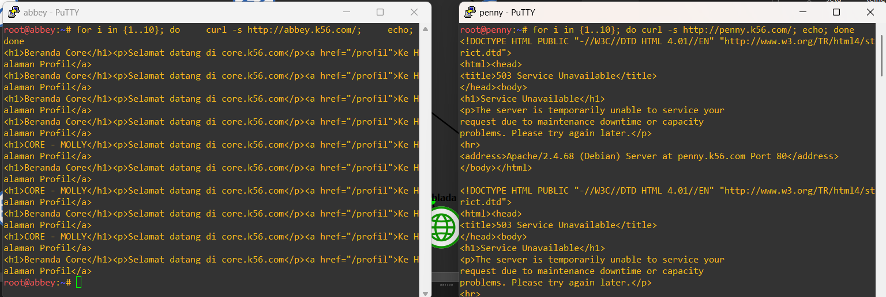

Reverse proxy berhasil dikonfigurasi. Request menuju `www.k56.com` diteruskan oleh Penny menuju backend Vault, sedangkan request menuju `static.k56.com` diteruskan oleh Abbey menuju backend Core. Header `Host` dan `X-Real-IP` juga diteruskan sesuai konfigurasi.


## 12. Basic Authentication pada Directory `/admin`

### Tujuan

Konfigurasi ini bertujuan untuk memberikan autentikasi pada directory `/admin`, sehingga halaman tersebut hanya dapat diakses oleh pengguna yang memiliki username dan password yang benar.

### Konfigurasi

Pada server **Penny**, dibuat file password menggunakan `htpasswd`:

```bash
htpasswd -c /etc/apache2/.htpasswd admin
```

Kemudian konfigurasi Apache pada directory `/admin`:

```apache
<Location /admin>
    AuthType Basic
    AuthName "Restricted Area"
    AuthUserFile /etc/apache2/.htpasswd
    Require valid-user
</Location>
```

Setelah konfigurasi selesai, Apache direstart:

```bash
service apache2 restart
```

### Pengujian

Pengujian dilakukan dari node client menggunakan `curl`.

Pertama, akses `/admin` tanpa username dan password:

```bash
curl -i http://www.k56.com/admin
```

Jika Basic Authentication berhasil, response akan menunjukkan:

```text
HTTP/1.1 401 Unauthorized
WWW-Authenticate: Basic realm="Restricted Area"
```

Selanjutnya, lakukan akses menggunakan username dan password yang telah dibuat:

```bash
curl -i -u admin:PASSWORD http://www.k56.com/admin
```

Jika kredensial benar, server akan memberikan response **200 OK** dan halaman `/admin` dapat diakses.

Untuk menguji kredensial yang salah:

```bash
curl -i -u admin:salah http://www.k56.com/admin
```

Response yang diharapkan:

```text
HTTP/1.1 401 Unauthorized
```

### Hasil


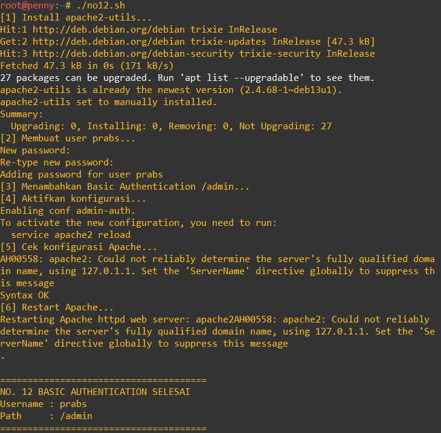
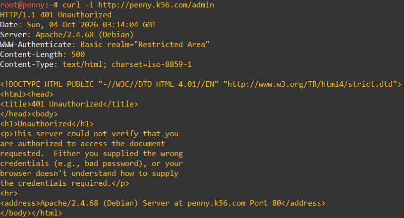

Basic Authentication berhasil diterapkan pada directory `/admin`. Akses tanpa kredensial atau dengan kredensial yang salah menghasilkan **401 Unauthorized**, sedangkan kredensial yang benar dapat mengakses halaman `/admin`.


## 13. HTTP Redirect

### Tujuan

Konfigurasi ini bertujuan untuk mengarahkan request dari URL tertentu menuju URL tujuan yang telah ditentukan menggunakan HTTP redirect.

Redirect dilakukan agar ketika client mengakses URL lama, server memberikan response redirect dan client diarahkan ke URL yang baru.

### Konfigurasi

Pada server yang digunakan, dibuat konfigurasi redirect menggunakan directive Apache:

```apache id="j4f7pa"
Redirect 301 /old-url http://www.k56.com/
```

Kode status **301** menunjukkan bahwa URL tersebut telah dipindahkan secara permanen.

Setelah konfigurasi selesai, Apache direstart:

```bash id="c7f1pz"
service apache2 restart
```

### Pengujian

Pengujian dilakukan dari node client menggunakan `curl` dengan opsi `-I` untuk melihat HTTP response header:

```bash id="9tvh5x"
curl -I http://www.k56.com/old-url
```

Jika redirect berhasil, response akan menunjukkan:

```text id="g1d5kh"
HTTP/1.1 301 Moved Permanently
Location: http://www.k56.com/
```

Untuk mengikuti redirect secara otomatis, gunakan:

```bash id="gkqf2s"
curl -IL http://www.k56.com/old-url
```

Opsi `-L` membuat `curl` mengikuti URL yang terdapat pada header `Location`.

### Hasil

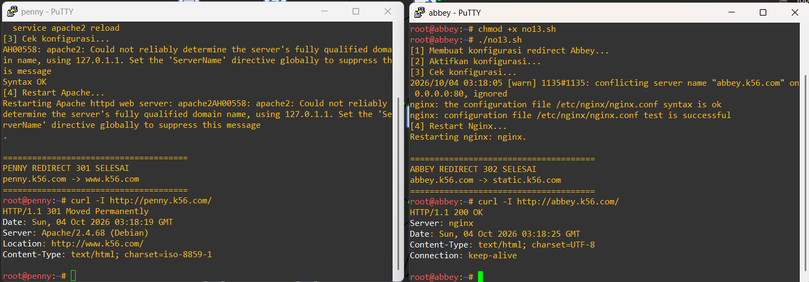

HTTP redirect berhasil dikonfigurasi. Ketika client mengakses URL sumber, server memberikan response **301 Moved Permanently** dan mengarahkan client menuju URL tujuan melalui header `Location`.


## 14. Forward Original Client IP

### Tujuan

Konfigurasi ini bertujuan agar IP asli client tetap dapat diteruskan dari reverse proxy menuju server backend.

Tanpa konfigurasi ini, backend hanya akan melihat IP reverse proxy sebagai sumber request. Dengan meneruskan header `X-Real-IP`, backend dapat mengetahui IP client yang sebenarnya.

### Konfigurasi Penny

Pada server **Penny**, header `X-Real-IP` diteruskan menggunakan Apache:

```apache id="h6v5sa"
RequestHeader set X-Real-IP "%{REMOTE_ADDR}e"
```

Module `headers` harus aktif:

```bash id="d8n4pe"
a2enmod headers
```

Kemudian Apache direstart:

```bash id="t8cj0k"
service apache2 restart
```

### Konfigurasi Backend

Pada server backend Apache, konfigurasi `mod_remoteip` digunakan agar Apache membaca IP client dari header `X-Real-IP`.

```apache id="j0c8pp"
RemoteIPHeader X-Real-IP
RemoteIPTrustedProxy 192.239.3.2
```

`192.239.3.2` merupakan alamat IP Penny.

Kemudian konfigurasi Apache direload/restart:

```bash id="s5qv2a"
service apache2 restart
```

### Pengujian

Dari node client, lakukan request menggunakan:

```bash id="q5f7ny"
curl -i http://www.k56.com/
```

Kemudian periksa access log pada backend Vault:

```bash id="m6v0ru"
tail -f /var/log/apache2/access.log
```

Jalankan kembali request dari client:

```bash id="9l7q3b"
curl http://www.k56.com/
```

Pada log backend, alamat IP yang tercatat seharusnya merupakan **IP asli client**, bukan IP Penny (`192.239.3.2`).

Untuk memastikan header diteruskan, konfigurasi Penny juga dapat diperiksa dengan:

```bash id="y6z1re"
grep -n "X-Real-IP" /etc/apache2/sites-enabled/penny.conf
```

### Hasil

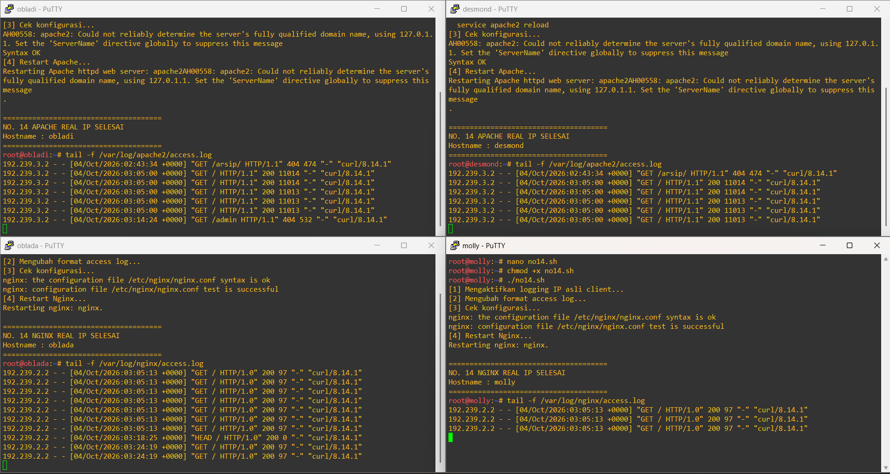

Konfigurasi berhasil meneruskan IP asli client melalui header `X-Real-IP`. Server backend dapat memperoleh alamat IP client asli meskipun request terlebih dahulu melewati reverse proxy Penny.


## 15. Path-Specific Web Service

### Tujuan

Konfigurasi ini bertujuan untuk menyediakan layanan web pada path tertentu yang berbeda dari layanan utama.

Pada konfigurasi ini:

* **Penny** menyediakan halaman pada path `/eternal/` dari directory `/var/www/eternal/` dan mendukung PHP.
* **Abbey** menyediakan halaman pada path `/orion/` dari directory `/var/www/orion/`.

### Konfigurasi Penny

Pada server Penny, path `/eternal/` diarahkan ke directory lokal:

```apache
Alias /eternal/ /var/www/eternal/

<Directory /var/www/eternal/>
    Options Indexes FollowSymLinks
    AllowOverride None
    Require all granted
</Directory>
```

Path `/eternal/` harus dikecualikan dari konfigurasi reverse proxy utama agar request tidak diteruskan ke backend Vault:

```apache
ProxyPass /eternal/ !
```

Konfigurasi PHP juga digunakan agar file PHP pada directory tersebut dapat diproses oleh Apache.

Setelah konfigurasi selesai:

```bash
service apache2 restart
```

### Konfigurasi Abbey

Pada server Abbey, dibuat directory:

```bash
mkdir -p /var/www/orion
```

Kemudian path `/orion/` diarahkan ke directory tersebut:

```nginx
location /orion/ {
    alias /var/www/orion/;
    index index.html;
}
```

Setelah konfigurasi selesai:

```bash
service nginx restart
```

### Pengujian Penny

Dari node client, jalankan:

```bash
curl -i http://www.k56.com/eternal/
```

Untuk melihat isi halaman:

```bash
curl http://www.k56.com/eternal/
```

Response harus menampilkan konten dari `/var/www/eternal/`.

Jika terdapat file PHP, PHP harus diproses oleh server dan **bukan menampilkan source code PHP**.

### Pengujian Abbey

Dari node client:

```bash
curl -i http://static.k56.com/orion/
```

Kemudian:

```bash
curl http://static.k56.com/orion/
```

Response harus menampilkan konten dari `/var/www/orion/`.

### Hasil

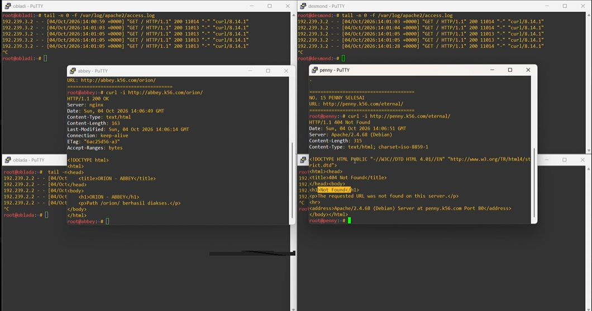

Path `/eternal/` pada Penny berhasil menyediakan layanan web lokal dengan dukungan PHP tanpa diteruskan ke backend Vault. Path `/orion/` pada Abbey berhasil menyediakan layanan web dari directory `/var/www/orion/`.


## 16. Pengujian Web Server dengan ApacheBench

### Tujuan

Pengujian ini bertujuan untuk mengetahui kemampuan web server dalam menangani sejumlah request HTTP secara bersamaan menggunakan ApacheBench (`ab`).

### Instalasi ApacheBench

Pada node client, install package `apache2-utils`:

```bash
apt update
apt install -y apache2-utils
```

Kemudian pastikan ApacheBench sudah tersedia:

```bash
ab -V
```

### Pengujian `www.k56.com`

Pengujian dilakukan dengan mengirimkan **250 request** menggunakan **10 concurrent request**:

```bash
ab -n 250 -c 10 http://www.k56.com/
```

Keterangan:

* `-n 250` → jumlah total request sebanyak 250.
* `-c 10` → maksimal 10 request dijalankan secara bersamaan.
* `http://www.k56.com/` → URL yang diuji.

Hasil pengujian menunjukkan:

```text
Complete requests:      250
Failed requests:        0
```

Artinya seluruh request berhasil diproses tanpa kegagalan.

### Pengujian `static.k56.com`

Pengujian kedua dilakukan pada layanan static:

```bash
ab -n 250 -c 10 http://static.k56.com/
```

Hasil pengujian menunjukkan:

```text
Complete requests:      250
Failed requests:        0
```

Artinya seluruh request juga berhasil diproses.

### Hasil

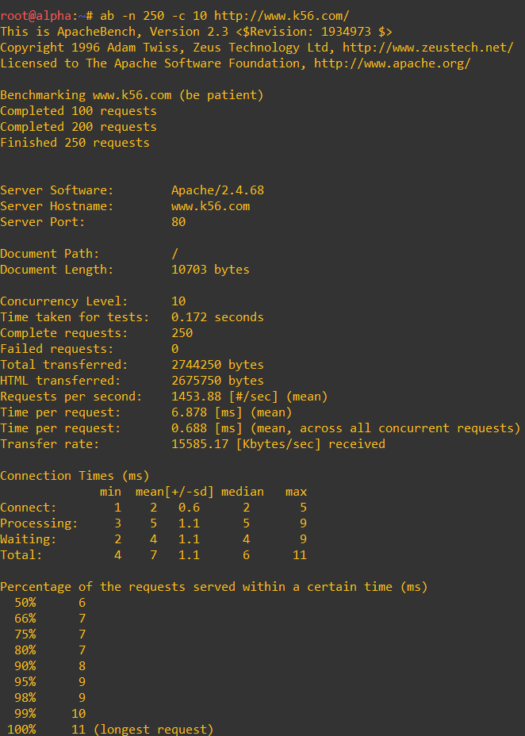
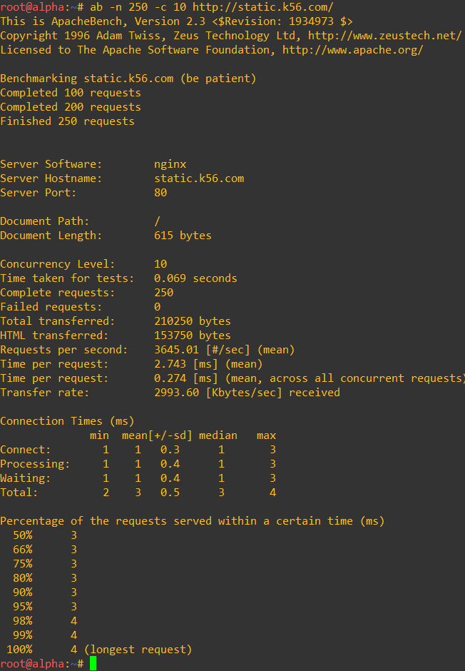

Berdasarkan pengujian ApacheBench, layanan `www.k56.com` dan `static.k56.com` mampu menangani 250 request dengan concurrency 10 tanpa failed request.
Pengujian ini menunjukkan bahwa konfigurasi web server dan reverse proxy dapat menangani request HTTP secara normal pada beban pengujian yang diberikan.


## 17. TXT Record

### Tujuan

Konfigurasi ini bertujuan untuk menambahkan **TXT record** pada domain `k56.com`. TXT record digunakan untuk menyimpan informasi berbentuk teks pada DNS.

### Konfigurasi

Pada DNS Master **Prab**, ditambahkan TXT record berikut pada zone `k56.com`:

```bind id="r8v4qu"
alpha    IN TXT "alpha"
beta     IN TXT "beta"
gamma    IN TXT "gamma"
delta    IN TXT "delta"
epsilon  IN TXT "epsilon"
```

Setelah melakukan perubahan zone, serial number dinaikkan dan konfigurasi diperiksa:

```bash id="0t0o2d"
named-checkconf
```

Kemudian periksa zone:

```bash id="6j7q0a"
named-checkzone k56.com /etc/bind/k56/k56.com
```

Jika hasilnya `OK`, reload BIND:

```bash id="fj7n5m"
service bind9 reload
```

### Pengujian

Pengujian dilakukan dengan `dig` dari client atau node lain.

Cek TXT record `alpha` melalui DNS Master:

```bash id="y3x3p8"
dig @192.239.1.2 alpha.k56.com TXT +noall +answer
```

Cek melalui DNS Slave:

```bash id="g3a2k1"
dig @192.239.1.3 alpha.k56.com TXT +noall +answer
```

Kemudian lakukan pengecekan untuk record lainnya:

```bash id="6l7p9d"
dig @192.239.1.3 beta.k56.com TXT +noall +answer
dig @192.239.1.3 gamma.k56.com TXT +noall +answer
dig @192.239.1.3 delta.k56.com TXT +noall +answer
dig @192.239.1.3 epsilon.k56.com TXT +noall +answer
```

Response yang diharapkan memiliki bentuk:

```text id="9a2w4j"
alpha.k56.com.    IN    TXT    "alpha"
```

Begitu juga dengan `beta`, `gamma`, `delta`, dan `epsilon`.

### Hasil

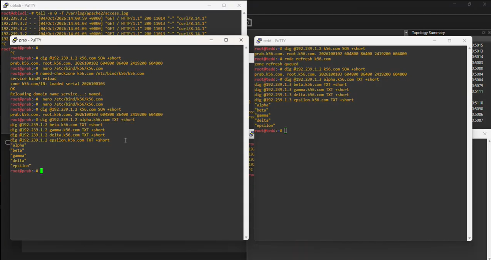

TXT record berhasil ditambahkan pada DNS Master dan dapat di-resolve melalui DNS Slave. Kelima hostname menghasilkan nilai TXT sesuai dengan konfigurasi yang dibuat.


## No. 18 - Pengujian TTL dan DNS Caching

### Tujuan

Melakukan pengujian terhadap mekanisme **TTL dan caching DNS** pada record `abbey.k56.com`.

### Pengujian

Cek terlebih dahulu record melalui DNS recursive:

```bash
dig @192.168.122.1 abbey.k56.com A +noall +answer
```

Kemudian cek langsung ke DNS master:

```bash
dig @192.239.1.2 abbey.k56.com A +noall +answer
```

Setelah melakukan perubahan record dan menaikkan serial zone, reload DNS:

```bash
service bind9 reload
```

Cek kembali record pada DNS master:

```bash
dig @192.239.1.2 abbey.k56.com A +noall +answer
```

Kemudian cek melalui recursive resolver:

```bash
dig @192.168.122.1 abbey.k56.com A +noall +answer
```

Jika data lama masih tersimpan pada cache, recursive resolver masih dapat memberikan IP lama. Setelah TTL habis, lakukan query kembali:

```bash
dig @192.168.122.1 abbey.k56.com A +noall +answer
```

Resolver kemudian akan mengambil data terbaru dari DNS authoritative.

### Hasil

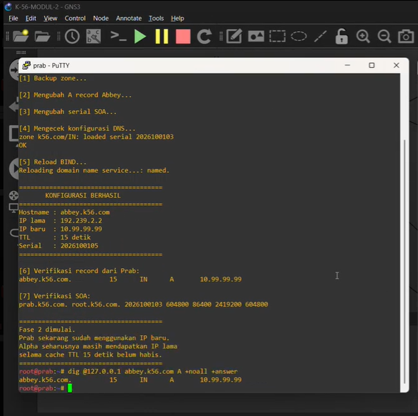

DNS master langsung memberikan record terbaru, sedangkan recursive resolver dapat mempertahankan record lama selama TTL masih berlaku. Setelah TTL habis, resolver memperbarui data dari DNS authoritative.

### Catatan

Konfigurasi perubahan pada No. 18 **diabaikan untuk No. 20**. Setelah pengujian selesai, `abbey.k56.com` harus dikembalikan ke:

```text
192.239.2.2
```


## No. 19 - CNAME Record ke Domain Eksternal

### Tujuan

Membuat **CNAME record** `outbound.k56.com` yang mengarah ke domain eksternal `http.badssl.com`.

### Konfigurasi

Pada zone `k56.com` di DNS master (`prab`), tambahkan:

```bind
outbound    IN    CNAME    http.badssl.com.
```

Setelah melakukan perubahan, naikkan **serial number** pada SOA kemudian cek konfigurasi:

```bash
named-checkconf
named-checkzone k56.com /etc/bind/k56/k56.com
```

Jika konfigurasi valid, reload DNS:

```bash
service bind9 reload
```

### Pengujian DNS

Cek CNAME pada DNS master:

```bash
dig @192.239.1.2 outbound.k56.com CNAME +noall +answer
```

Cek pada DNS slave:

```bash
dig @192.239.1.3 outbound.k56.com CNAME +noall +answer
```

Cek melalui recursive resolver:

```bash
dig @192.168.122.1 outbound.k56.com CNAME +noall +answer
```

Hasil yang diharapkan:

```text
outbound.k56.com.    ...    IN    CNAME    http.badssl.com.
```

Kemudian cek resolusi alamat IP:

```bash
dig @192.168.122.1 outbound.k56.com A +noall +answer
```

### Pengujian HTTP

Lakukan request menggunakan `curl`:

```bash
curl http://outbound.k56.com
```

Request tersebut menggunakan `outbound.k56.com`, tetapi DNS akan mengarahkannya melalui CNAME ke `http.badssl.com`.

### Kesimpulan

CNAME `outbound.k56.com` berhasil dibuat dengan tujuan `http.badssl.com`. Keberhasilan konfigurasi dapat dibuktikan melalui hasil `dig` yang menunjukkan CNAME tersebut, kemudian akses HTTP diuji menggunakan `curl`.

**Catatan:** Jika `curl` menghasilkan halaman blokir dari jaringan/filter eksternal, hal tersebut belum tentu berarti CNAME gagal. Pastikan terlebih dahulu hasil `dig` menunjukkan:

```text
outbound.k56.com.    IN    CNAME    http.badssl.com.
```

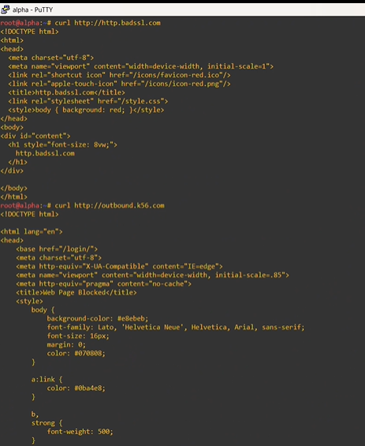


## No. 20 - Pengujian Service dan Autostart Setelah Restart

### Tujuan

Memastikan seluruh service dan konfigurasi yang telah dibuat tetap berjalan dengan normal dan **otomatis aktif setelah node di-restart**.

Konfigurasi pada **No. 18 diabaikan** untuk pengujian ini.

### 1. Pastikan Record Abbey Dikembalikan

Pastikan `abbey.k56.com` kembali menggunakan IP normal:

```text
192.239.2.2
```

Cek dari DNS master:

```bash
dig @192.239.1.2 abbey.k56.com A +noall +answer
```

Hasil yang diharapkan:

```text
abbey.k56.com.    ...    IN    A    192.239.2.2
```

### 2. Restart Node

Pada environment GNS3 yang digunakan, jika perintah `reboot` tidak tersedia, restart dilakukan melalui GNS3:

1. Klik kanan node.
2. Pilih **Stop**.
3. Tunggu sampai node benar-benar berhenti.
4. Pilih **Start**.
5. Buka kembali console node.

### 3. Cek Service Setelah Restart

Pada **prab** dan **tedd**:

```bash
service bind9 status
```

Pada node yang menjalankan Apache:

```bash
service apache2 status
```

Pada node yang menjalankan Nginx:

```bash
service nginx status
```

Service harus langsung berjalan setelah node dinyalakan kembali tanpa menjalankan perintah `start` secara manual.

### 4. Pengujian DNS

Cek DNS master:

```bash
dig @192.239.1.2 www.k56.com A +noall +answer
```

Cek DNS slave:

```bash
dig @192.239.1.3 www.k56.com A +noall +answer
```

Cek record `abbey`:

```bash
dig @192.239.1.2 abbey.k56.com A +noall +answer
```

Hasil `abbey.k56.com` harus kembali:

```text
192.239.2.2
```

### 5. Pengujian Web

Uji web melalui domain:

```bash
curl http://www.k56.com/
```

Uji static web:

```bash
curl http://static.k56.com/
```

Uji path khusus:

```bash
curl http://www.k56.com/eternal/
```

```bash
curl http://static.k56.com/orion/
```

### 6. Pengujian CNAME

Pastikan konfigurasi No. 19 tetap tersedia:

```bash
dig @192.239.1.2 outbound.k56.com CNAME +noall +answer
```

Hasil yang diharapkan:

```text
outbound.k56.com.    ...    IN    CNAME    http.badssl.com.
```

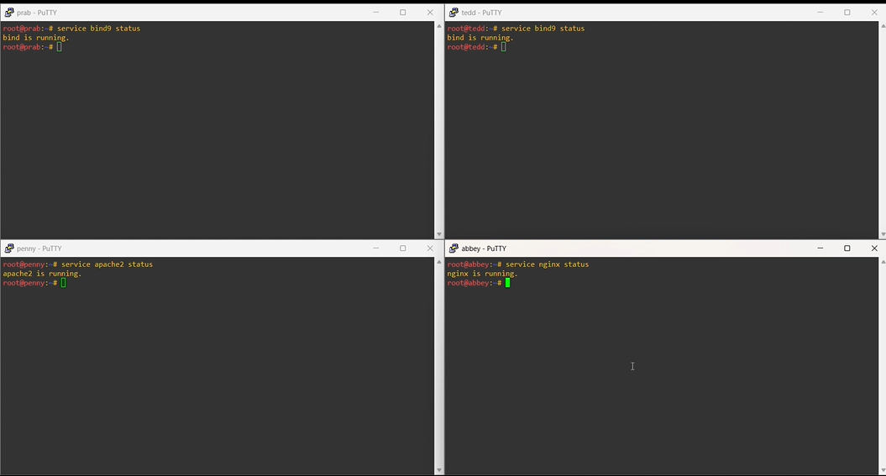
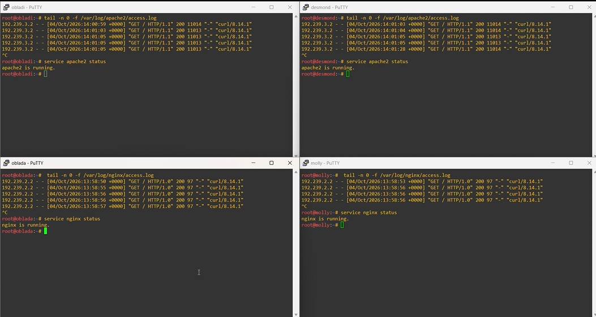

### Kesimpulan

Setelah seluruh node direstart, dilakukan pengecekan terhadap service DNS, Apache, dan Nginx serta pengujian kembali konfigurasi DNS dan web. Jika service langsung aktif setelah node dinyalakan dan seluruh pengujian berhasil, maka konfigurasi telah berjalan secara **autostart** dan tetap persisten setelah restart.

Konfigurasi eksperimen **No. 18 tidak digunakan** dalam pengujian akhir.


## REVISI
---
### No 6
---
Pada pengujian awal, serial SOA pada prab dan tedd berbeda karena tedd masih menyimpan salinan zona dengan serial yang lebih tinggi dibandingkan master prab. Kondisi ini menyebabkan slave menganggap data yang dimilikinya lebih baru sehingga tidak langsung melakukan sinkronisasi. Setelah serial pada prab dinaikkan dan dilakukan reload serta refresh pada tedd, kedua server memiliki serial SOA yang sama dan zona berhasil tersinkronisasi.


### No 9
---
Pengujian dilakukan melalui hostname vault.k56.com menggunakan Lynx. Halaman Index of / berhasil tampil beserta daftar file di dalam direktori, sehingga layanan Apache dan fitur autoindex telah berjalan dengan benar.
```
lynx http://vault.k56.com/
```


### No 10
---
Pengujian dilakukan melalui hostname core.k56.com menggunakan Lynx. Halaman beranda dan halaman profil berhasil diakses, termasuk URL bersih /profil tanpa akhiran .php, sehingga konfigurasi Nginx, PHP-FPM, dan rewrite telah berjalan dengan benar.
```
lynx http://core.k56.com/
```

#### Oblada


#### Molly


